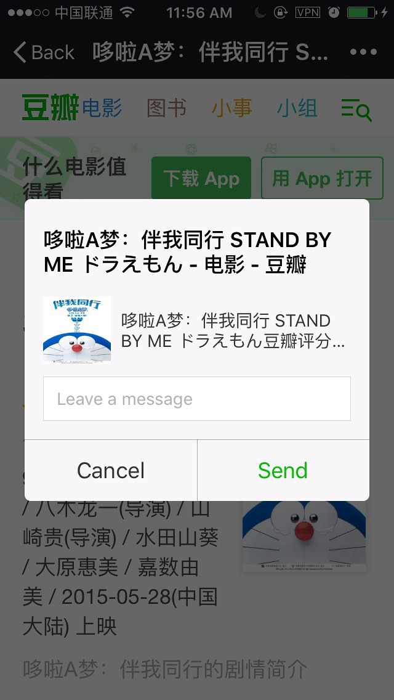
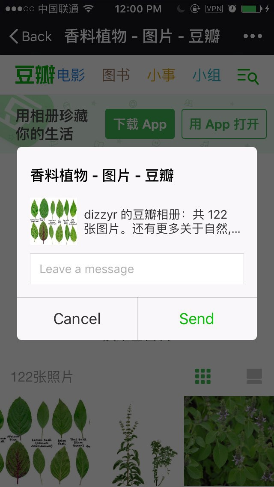
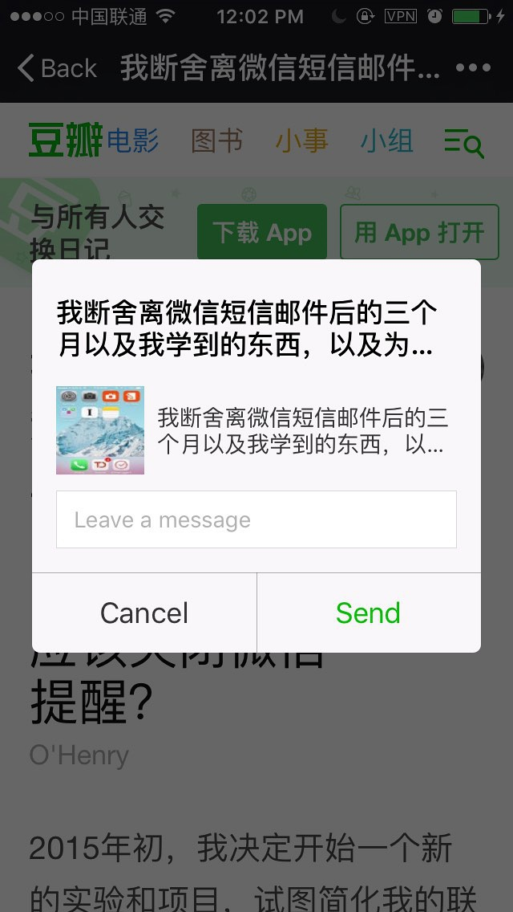

真的有很久很久没来理这个博客，距离上一篇文章的发布日期是两年前。
毕业工作后来了豆瓣，最近对移动环境（主要是浏览器及微信）的 SEO 相关进行了下研究，正好在这里分享一下。

以下，Enjoy。

<!--truncate-->

---

### 1. SEO：Search Engine Optimization

产品：搜索引擎优化，促进内容网站信息分享／传播，提高目标转化率，留存率

工程：为各类页面实现统一的信息分享、传播，提高搜索排名（search ranking）

个人觉得：

- 豆瓣是一个内容网站，拥有一些 UGC 优质内容，SEO 间接帮助用户分享。
  且分享率越高，也会提高搜索排名。
- M 站的目前面向** 人（User） **的 UX 比较完善，但是仍需要丰富一些细节，让 **Search Engine** 的 UX 更好，更好地理解 M 站。


### 2. 前端在 SEO 中的位置

- **帮助产品进行TDK （Title / Description / Keyword）优化**
- **添加一些 Social Meta Tag （Facebook / Twitter / G+ / WeChat / Weibo）**
- 页面内容优化（HTML5 标签语义化、唯一的 H1 标题、img 设置 `alt` 属性，不需要爬虫跟踪的链接加 `nofollow`）
- URL 优化 (**canonical**，标签表示页面的唯一性)
  - 在搜索引擎里，**只有链接完全一样，才会认为是同一个链接**，如果链接带上参数，虽然访问到的内容还是一样，但是在搜索引擎看来确是不同的链接，页面抓取也会出现多次，从而导致多个链接，内容一样。
  - 因此 URL 中最好是不要带上查询参数。但为了产品统计数据，总需要 `?from=xxx&refer=xxx`等参数，所以使用 `canonical`标签来确保链接唯一性，避免权重分散、流失。
  - 比如 ` m.douban.com/group/topics[?start=xxx]`均视为同一个页面这里的 `?start=xxx`是一个分页查询参数，所以为了确保这些页面都能继承 m.douban.group/toics 这个 url  的权重，在`head`中增加了`canonical`标签
- Meta robots
- Sitemap


### 3. 具体实现

> **统一 SNS 抓取**
>
> 提供一个 mako 函数，统一分享的标题、图片、描述
>
> - Open Graph
> - Twitter Card
>
> **实现统一的分享接口**
>
> 可变的图片、标题、描述
>
> - 微信 （iOS、Android 系统分享菜单、微信内置分享）
>
> - - 外部调用分享可能会抓取标题、第一个图片地址（Open Graph）
>   - 调用内置分享可用第三个链接 (API 跨子域)
>
> - 微博
>
> 参考链接：
>
> [https://developers.facebook.com/docs/sharing/opengraph](https://developers.facebook.com/docs/sharing/opengraph)
>
> [https://dev.twitter.com/cards/overview](https://dev.twitter.com/cards/overview)
>
> [http://github.intra.douban.com/frodo/Talion/blob/master/views/j/wechat/__init__.py](http://github.intra.douban.com/frodo/Talion/blob/master/views/j/wechat/__init__.py) 
>
> — From [Douban FE Dropbox](https://paper.dropbox.com/doc/-SEO-UVIgU3WYPUeiJv3nOPP0N)


### 实现方案

#### 1. 增加了 `seo_meta()` Mako widget

 http://github.intra.douban.com/frodo/Talion/blob/master/templates/card/widgets.html#L527

```html
<%def name="seo_meta(title, desc, image=None, url=None, type=None, rating_count=None, rating_val=None, wechat_timeline_title=None,wechat_chat_title=None, wechat_desc=None, wechat_image=None)">
    <%
        from douban.image.qiniu import qiniu_proxy_url

        default_title = '豆瓣'
        default_desc = '读书、看电影、涨知识、学穿搭...，加入兴趣小组，获得达人们的高质量生活经验，找到有相同爱好的小伙伴。'
        default_image = static('/pics/icon/m_logo_180.png')
        default_url = 'http://m.douban.com/'
        default_type = 'article'
        image = qiniu_proxy_url(image, 300, 300, mode='1') if image else ''
    %>
    <!-- Schema.org markup for Google+ -->
    <meta itemprop="name" content="${ title or default_title }">
    <meta itemprop="description" content="${ desc or default_desc }">
    <meta itemprop="image" content="${ image or default_image }">
    % if rating_count:
    <meta itemprop="reviewCount" content="${ rating_count }">
    % endif
    % if rating_val:
    <meta itemprop="ratingValue" content="${ rating_val }">
    % endif
    <!-- Twitter meta -->
    <meta name="twitter:card" content="summary" />
    <!-- Open Graph meta -->
    <meta property="og:title" content="${ title or default_title }" />
    <meta property="og:description" content="${ desc or default_desc }" />
    <meta property="og:site_name" content="豆瓣(手机版)" />
    <meta property="og:url" content="${ url or default_url }" />
    <meta property="og:image" content="${ image or default_image }" />
    <meta property="og:image:type" content="image/png" />
    <meta property="og:image:width" content="300" />
    <meta property="og:image:height" content="300" />
    <meta property="og:type" content="${ type or default_type }" />
    <!-- Wechat meta -->
    <meta property="weixin:timeline_title" content="${ wechat_timeline_title or '' }" />
    <meta property="weixin:chat_title" content="${ wechat_chat_title or '' }" />
    <meta property="weixin:description" content="${ wechat_desc or '' }" />
    <meta property="weixin:image" content="${ image or default_image }" />
    <%block filter="collect_js">
    ;(function () {
        window.setMeta = function (name, val) {
          var meta = document.querySelectorAll('meta[property="' + name + '"], meta[name="' + name + '"]')
          if (!meta.length) {
            meta = document.createElement('meta')
            meta.name = name
            document.head.appendChild(meta)
          }
         meta[0].content = val || ''
        }
        window.getMeta = function (name) {
          var meta = document.querySelectorAll('meta[property="' + name + '"], meta[name="' + name + '"]')
          if (!meta.length) {
            return ''
          } else {
            return meta[0].content
          }
        }
        setMeta('og:url', location.href)
        !getMeta('weixin:chat_title') && setMeta('weixin:chat_title', document.title)
        !getMeta('weixin:timeline_title') && setMeta('weixin:timeline_title', document.title)
        !getMeta('weixin:description') && setMeta('weixin:description', getMeta('og:description'))
    })();
    </%block>
</%def>
```


#### 2. 给 m 站大部分页面增加了 SEO Meta Tags

之前分享出去抓不到自定义的 description 和 image ，现默认分享到 weixin 的 title 、 description 、image 值都和 Open Graph 一样，也可以自定义。

默认情况下

- `og:title`，` og:description` 和之前的 title, description 一样；


- `og:url`： 当前页面 url；
- `og:image`：
  -  小组帖子页和单个日记页如有图片，则为第一张图片的 src url，没有的话为现在默认的分享 icon src url；
  -  条目页的均为该条目的 image src url；
  -  相册页为该相册第一张 image src；
  -  豆列、标签页为默认的分享 icon src


- **Hashtag 页**

  - image: 运营头图 || 豆 icon；
  - title: `{ hashtag_name} - 豆瓣`；
  - description: 运营描述 || '有关`#{ hashtag_name }`#的话题讨论，豆瓣用户参与的精彩话题'；

- **单条广播页**

  - 微信聊天、朋友圈：image =  广播第一张图 || 豆 icon；
  - 微信聊天页： title = XXX 的豆瓣广播; description = 广播文字内容的前十五个字 || 默认的 m 站描述；
  - 微信朋友圈： title = 广播文字内容前十五个字 || XXX 的豆瓣广播

- 关于 image 图片规格：

  为了使抓取的图片更优雅，不被压缩变形，使用「七牛图片服务」进行剪裁。

  默认 `og:image` 等 image 均会被以 `width = height = 300` 进行处理。

  - [Talion](http://github.intra.douban.com/frodo/Talion/tree/23fe149cc3186f15195634cca774861d3ce9efca)/[libs](http://github.intra.douban.com/frodo/Talion/tree/23fe149cc3186f15195634cca774861d3ce9efca/libs)/**image.py**
  - http://github.intra.douban.com/frodo/Talion/blob/23fe149cc3186f15195634cca774861d3ce9efca/libs/image.py#L11
  - `from douban.image.qiniu import qiniu_proxy_url`


效果截屏：

http://github.intra.douban.com/frodo/Talion/pull/253


#### 3. 统一分享接口（微信重度使用患者）

- [weixin.js](http://github.intra.douban.com/frodo/Talion/blob/master/static/js/card/weixin.js#L52)、 [微信 JSSDK 文档](https://mp.weixin.qq.com/wiki/7/aaa137b55fb2e0456bf8dd9148dd613f.html#.E5.88.86.E4.BA.AB.E6.8E.A5.E5.8F.A3)

```javascript

wx.onMenuShareTimeline($.extend({}, shareData,{
    title: window.getMeta('weixin:timeline_title') || document.title,
    success: function () {
        wxShareStat.target = 'timeline';
        $.get('/j/wechat/shared', wxShareStat);
    },
    cancel: function () {}
}));

wx.onMenuShareAppMessage($.extend({}, shareData,{
    title: window.getMeta('weixin:chat_title') || document.title,
    desc: window.getMeta('weixin:description') || window.getMeta('og:description'),
    success: function () {
        wxShareStat.target = 'friend';
        $.get('/j/wechat/shared', wxShareStat);
    },
    cancel: function () {}
}));
```

  结合使用 `meta[name="weixin:image"]`

```html
<meta property="weixin:timeline_title" content="${ wechat_timeline_title or '' }" />
<meta property="weixin:chat_title" content="${ wechat_chat_title or '' }" />
<meta property="weixin:description" content="${ wechat_desc or '' }" />
<meta property="weixin:image" content="${ image or default_image }" />
```

-  自定义微信分享到聊天、朋友圈的显示内容，文案`setMeta()`, `getMeta()`

-  **Tips:** 如果没有设置 `wx.onMenuShareTimeline()`/ `wx.onMenuShareAppMessage()` 中的 title / imgUrl / desc 参数，微信内置浏览器默认抓取对应的`og:xxx` 相关。

-  **Bugs:** 通过 Safari Extension 分享出来的永远抓的是 `apple-touch-icon` 😂

```html
<link rel="apple-touch-icon-precomposed" href="https://img3.doubanio.com/f/talion/315ba4fc82e5cdb5c50ef1d9f88c8aa2c5c0c4ba/pics/icon/m_logo_76.png">
```

微信分享效果图：





### Further Reading & Resource

1. Sitemap & [Deadlink](http://baiduseoguide.com/news/20141128113.html)
2. Social Meta Tag Cheatsheet
3. Google SEO TOP1: Baidu Baike 😂
4. [Apple Safari supported meta tags](https://developer.apple.com/library/safari/documentation/AppleApplications/Reference/SafariHTMLRef/Articles/MetaTags.html)
5. [Google SEO search-engine-optimization-starter-guide](http://static.googleusercontent.com/media/www.google.com/en//webmasters/docs/search-engine-optimization-starter-guide.pdf)
6. Google 结构化数据标记辅助工具
7. [SEO Tutorial](http://www.hobo-web.co.uk/seo-tutorial/)
8. [京东 SEO](http://www.ghugo.com/jd-seo/)
9. SEO Tools
   - [Google Webmasters Search Console](https://www.google.com/webmasters/)
   - [Varvy SEO tool](https://varvy.com/tools/)
   - [Keyword Tool](http://keywordtool.io/)

