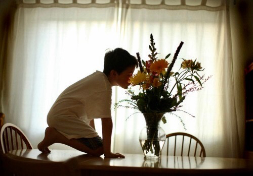
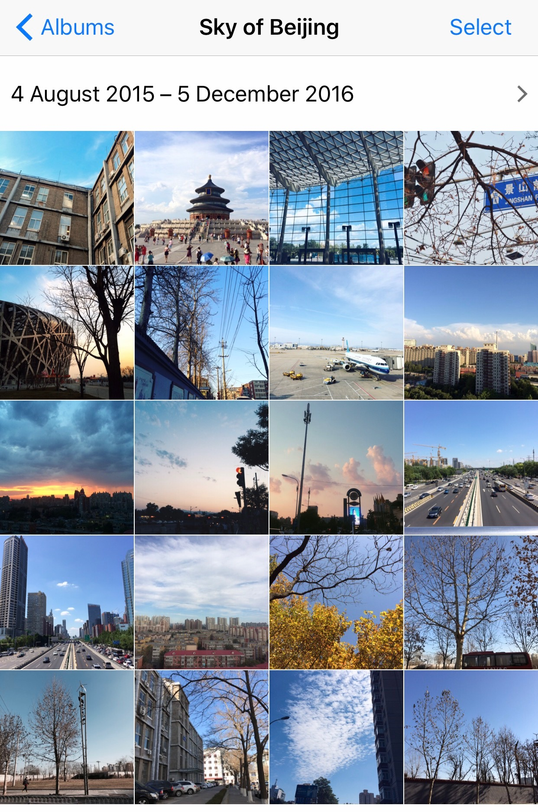
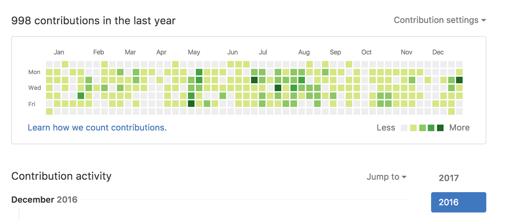
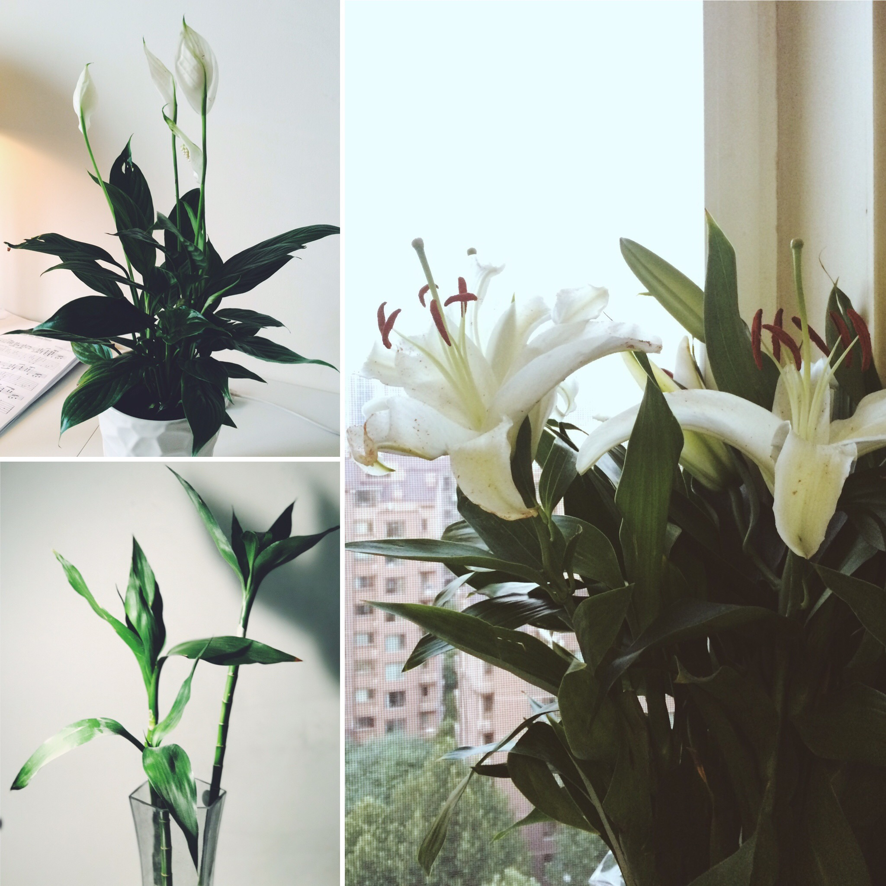
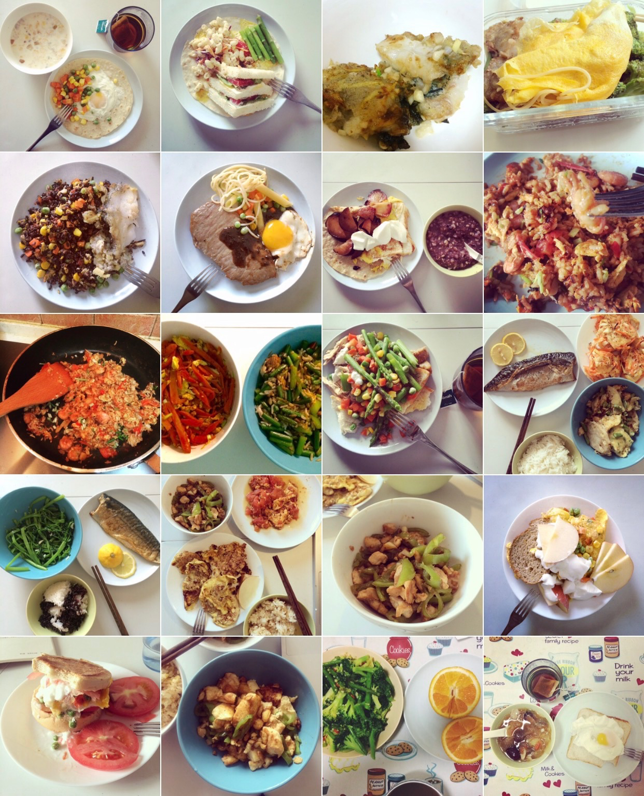
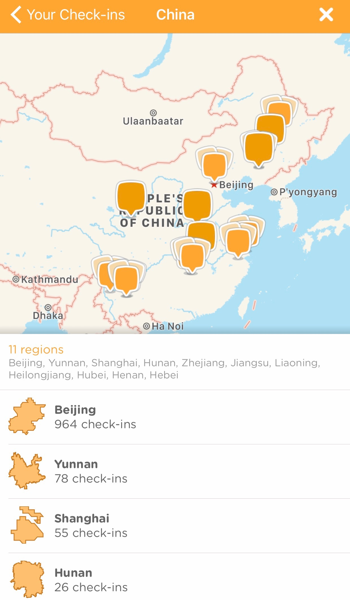
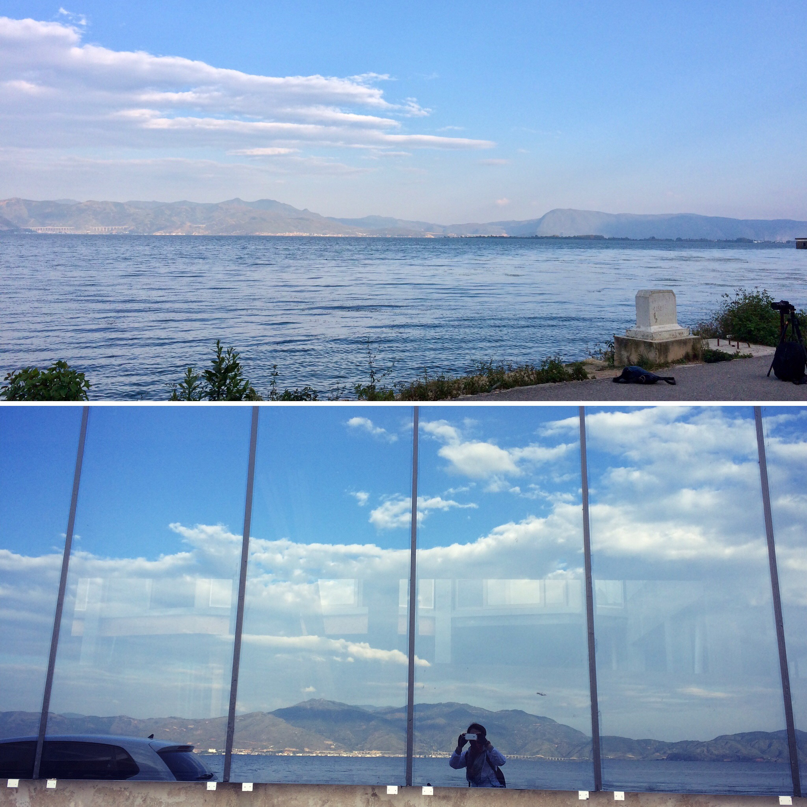

# 豆瓣、北京、工作，及终于与自己握手言和的 2016

> 在隆冬，我终于知道，我身上有一个不可战胜的夏天。 — 加缪

**豆瓣**

在 2015 年末，我在笔记本上这样写着：
> 有时候在想，能加入豆瓣也真的算是一种幸运。豆瓣这家公司，之前或现在，算是由复旦和华科这两所我很喜欢的学校的人组成，所以有些时候，对于这里的各种相似人生观、世界观及价值观会特别认同。就算偶尔也会对自己现在的能力与效率感到一点焦虑，不过不管怎么说，只要不退步，总是会前进。

15 年夏天，我加入了豆瓣。 
对，就是这个文艺得出了名的互联网公司。 
还记得 14 年底我正上大四，尴尬的时间，面临找工作选公司的窘境。 
而当时的我，喜欢拍照听歌，弹弹吉他，看些好玩的杂书，见到迷人的设计会兴奋不已，所以在那所死板沉寂绩点为王的工科学校，自认为算是个文艺青年。但是我也一直喜欢硬件，喜欢消费电子，喜欢拆装，享受通过自己动手创造出东西的过程，喜欢 Web，也能写点代码，人生某个阶段曾把成为一名 Geek 作为理想之一。于是不想浪费自己的底子，想着还是可以干点有技术含量的活，那么就去文艺气质的公司做点技术活吧，在不毁自己三观的同时还能养活自己，我是这么想的。
幸运的是，在我做决定的四个月后，我收到了来自豆瓣的 Offer。 

<!-- truncate -->

毕业前领取三方时候，我特意看了下，电工学院的同学们一个个不是去了华为中兴烽火，就是 XX 电子集团 XX 研究所。辅导员问我去了哪，我幽幽地说，豆瓣... 他大吃一惊，你咋这么浮夸呢。

其实冥冥之中，我与豆瓣是有缘分的。 
12 年初在上大一的我，在找某本书的时候第一次遇到了豆瓣，注册帐号填昵称时候，刚好想着自己在郫县上大学，这里有好吃的豆瓣酱，那么干脆就叫 “郫县豆瓣” 吧。
去年过年，公司刚好发了一大袋豆瓣酱作为礼物，恰好也是郫县产的，于是那天郫县豆瓣收到了来自豆瓣的郫县豆瓣酱。

我以为我已经够文艺了，来了之后才发现，远远不够。 
在豆瓣，你会想去听更多小众的唱片，读更多有深度的书，看更多有意思的电影话剧舞台剧，因为在这里工作，每天打开就是各种书影音页面，平时还有老师是痛仰乐队吉他手的大豆瓣吉他班，拥有一些好片子的独家片源的豆瓣 D9 放映室，同时还有一群文艺气质满满自带情怀的厂工。有时候会在想，是环境导致你改变了呢还是说你本质就是这样的人，但只是这种气质更显著了？不重要，至少我做到了「不毁三观的同时还能养活自己」。

现在回过头来看，真的很感谢豆瓣。 
首先解决了我的工作问题，其次又解决了我的房子问题，然后还解决了我的室友问题。 
同时，它也是一个帮助我实现自我价值的平台，可以让我用技术服务千万用户，可以给我参加 JSConf 的机会，可以让我和之前特别崇拜的业内大神们一起交流。

也许在互联网行业，创立十年之余的豆瓣可能在某些方面过于慢，慢得令人发指，慢得根本不及那些创立没几年但火爆的现象级公司。但这并不妨碍我对它初衷的喜爱，毕竟，生活不止有眼前的苟且，真的还有诗和远方。 
我总是不想成为一个无趣的人的。 
希望自己能够永远理想主义般活着。

---
**北京**

一些老友或者新朋友见面，总会问我，为什么你会来北京？ 
我总是半开玩笑的回答，「没办法，只有北京要我啊」。 
也很感到幸运的是，自己还是来到了北京。

尽管这里会有雾霾，会消费很高可能积攒不下太多钱，会要每天与一百万人挤地铁，但是，我也能见到繁华的万家灯火，吃各种好吃的，看各种有意思的展听各种有意思的 Live，认识到各种各样有趣的努力活着的人，接触到各类有深度的思想文化，利用这里有的各种资源感受各种社会，这对于来自小城市的我真的是一种莫大的吸引，大家都在这里努力地活着，你会觉得你活在这里每天都是不一样的。

大城市包容又开放，很讲秩序和规则，对我这种既不世故也不圆滑，同时也并不想变成这样的人，在某种程度上有一种舒适安全感。 
每天来往的人很多，但是大家都相互尊重讲礼貌，有些时候也能感受到人情。

去年七月份的某天，我走在路上忽然遇到了大暴雨。北方是很少下雨的，那样大的暴雨更是突然。只能狼狈找了个屋檐临时躲雨，一开始还以为是个店面，结果却是在别人的家门口。一个临马路的小房间，里面放了一张上下铺，一对夫妇就这么挤在这里。他们很热心地叫我进来坐，说里面还有个小沙发，女主人很利索地把角落小沙发打扫了下，于是我很不好意思地坐下了。聊了会天发现是外地打工夫妇在这里做房屋装修，屋子是临时租的。男主人仍旧很热心地说，等下你走的时候拿把伞吧，见我推辞，他说没关系的，我们还有两人的伞，你以后有空还过来就好，反正我们还要在这住两个月。临走之前其实雨已经小得差不多了，可是他们却仍把伞塞给我，怕我淋着。当时瞬间就被感动了，这就是我所理解的北京吧。

我是个情绪受天气影响挺重的人，之前在成都四年，那里阴霾潮湿的天气直叫人抑郁。 
最喜欢北京的，大概就是大蓝天了。 
北方的天空直接、干脆，让来自南方的孩子迷醉。 
大晴天随意走在路上，放眼望去一片湛蓝，愉悦、心旷神怡，「梦想更是直接的，让你觉得十二三岁时最喜欢用的 “梦想”、“人生” 等大词真的实实在在靠近。」 
所以天气好的时候，我走路基本都是抬着头，总会忍不住拍几张照片记录下好看的天空。


其实来北京后，自己看世界的角度与思考架构也起了翻天覆地的变化。 
看到过一段话，
> 一个人想要进步的最好方法是什么？绝对不是玩命的读书自学，在自己体内累积信息和知识，而是把自己置身到一个更优质的协作关系中。在核心地带，每天光订外卖，叫车这种响应和协作的速度，就会重新雕塑你的人生的感觉。

在北京，互联网行业的一切都在高速地迭代，与个人发展正相关的行业环境，以及每天前沿思潮碰撞，不知不觉大脑就有了一种全新的感觉，像完成了一次升级。

---
**工作与职业**
> 如果一个事情是你从零开始做，后小有所成，你便会加倍珍惜，这是一种仪式感，能带给人以高潮。

既然追求设计的美，但又想做点技术活，「前端开发工程师」这个职业一开始真的觉得很适合自己吧。 
很多年前，在 QQ 空间还很火爆的时候，我就喜欢去网上找代码，把自己的空间弄得特别好看。当时如果坚持下来，现在可能也是「QQ空间网红」一枚。 
后来直到大四找工作，才从零开始认认真真研究这类技术，一个人每天背着几本厚厚的 HTML & CSS & JS 书，去图书馆认认真真啃了两个月。自己的第一个网站上线的时候，激动地电脑刷完平板刷、平板刷完手机刷。一有时间就去浏览 GA，看看今天是不是又新增了访客。

毕业后如愿以偿找到工作来了豆瓣。想着自己的代码即将上线，被千万用户使用，每次提 PR (Pull Request) 都莫名有一种仪式感。 
整理代码，rebase commits，基本上我每次都会把 PR 描述写得很详细，从需求是什么，自己做了什么更新，遇到大功能更改，还会把现在更新和之前相比有什么不一样，选择的何种方案，遇到了何种问题及自己对问题的思考过程列出来，附上 preview 地址，有时候还会贴下前端效果图，然后 @相关厂工，把那句 “Please review, thanks!” 一个字母一个字母敲上，最后郑重点击提交。 
接下来就是激动地等着自己的代码被 review，被 merge，被上线。 
看到线上效果后，就算只是一点点小功能，你还是会珍惜，有时候真会出现传说中的 “颅内高潮”。

突然意识到自己工作对别人也是有价值的，是某天一个厂工跟我说，我两个月前写的一个小项目他们还一直在使用，数据一直在更新，那些东西一直在线上跑着呢。我才突然想到，噢，原来它们是有生命的，真的不用管也能活得很好。

酱厂虽然没有加班文化，但项目紧急的时候还是会写代码到很晚。 
没有两三点修过 bug，不足以谈人生。 
当然，修别人留下的棘手 bug 尤其痛苦，所以也会有很累想停下来的时候。 
有天整理了一份业内前辈的[博客清单]( http://zhangbinliu.me/follow-the-progressive/)，当自己觉得缺乏灵感，身体被掏空，会去那些一直前行孜孜不倦的前辈们那里学习学习，激励自己跟上他们的步伐。

其实有时我还是担心自己的职业的。 
比如说现在的 AI，有天在 GitHub 上偶然看到神经元版 [Flappy-Learning-Bird](https://github.com/xviniette/FlappyLearning/)，让我开始怀疑自己的工作，前端毕竟不是一门技术门槛很高的手艺，它有些时候体力活会很多。如果机器可以写出比你更好的代码，而你写不出制造那种机器的代码，以后是不是会被取代？ 
后来几天，我开始学起了算法。

希望自己可以朝更智能的方向前进。 
希望自己能够继续带着匠人仪式感活着。

---
**租房、一个人住**

也许是在真正一个人住以后，我才意识到自己突然多么自由。 
虽然我是从初中就开始寄校住宿，但是从来没有完整地在没有父母打扰外人干扰的情况下，拥有一个完完全全属于我自己的一个空间。过去二十二年，我像被困在一个硬盒子里，硬盒子里有各种各样你不喜欢也不能无视的东西。 
但当我第一次躺在自己租的第一个小房间的地板上，那一瞬间，盒子里那些曾经不能无视的东西都消失了，盒子的四壁向外倒塌了，平平地向四面延伸展开，外面出现了整个世界！从现在开始，每一天二十四小时竟然都是我自己的，穿什么、吃什么、去哪里、几点睡、要不要说话、躺床上还是躺地板上，竟然都是我自己完完全全可以决定的了。 
很多刚开始北漂的人都会有点想家，而我却十分没心没肺地享受那种前所未有的自由感。 
我终于独立了，终于可以自己决定自己的每天的生活了！

“人们在最破落的地板上也要铺上地毯，在最简陋的桌上也要摆上一束花，在最昏暗的房间里也要点上一盏灯。”

我一直都很信那句话，房子是租来的，生活不是。 
也是在一个人住后，我才发现我对于家居家具尤其是厨具的喜爱。曾经有段时间达到了每半个月逛一次宜家，虽然每次人都是很多，虽然每次都是那点东西，但是我总能发现不一样的地方。居家属性爆棚到以至于每次看到一些心仪的厨具，我脑海里面都能脑补出来我使用它们的场景。 
朋友们都会说，啊，你真是一个热爱生活的人。 
有时候足够幸运，终于碰上聊得来的室友，一起做几道简单的菜作为晚餐。我们坐在桌子两端，整个小屋子气氛很好，家常菜不能算得上美味，但是却让人觉得踏实。有那么一刻，我觉得好像我们并不是在北京漂泊的两个人，而是在家生活的好朋友，而这个租来的小屋子并没有那么多排斥我们的气息，反倒有一种格外的包容。

当然有时候也还是会难受得想哭。 
现在坐在家里，还是能回想起 15 年九月底，因为一些突发情况，我不得不短期内从租来的第一个房里搬出去。正好是中秋节前一个周末，一个人沿着 14 号线，一大早走到晚上找房，大概走了两万五千步，看了各种迥异的房子和各种房客的迥异人生，不由自主一直哼着那首人来人往。也终于有所不安，终于体会到居无定所的可怕及「漂」的真正含义。 
那天最后好歹是解决了房子问题。晚上大家都在欣赏圆月，而我回到那个即将搬离的家，听着来北京前友人送的那首《一个人的北京》，「许多人来来去去，相聚又别离，也有人喝醉哭泣，在一个人的北京」，突然就红了双眼，眼泪止不住的流。

熬过那些负面情绪，又经历了自己组装衣柜书架，修理燃气灶下水道空调床垫饮水机暖气片，学会和各种各样的人周旋打交道，生活自理基本独立，性格脾气都变好了。 
一个人住也给了我极大的独处空间，学会如何与自己相处。

离开父母一个人独立生活，也渐渐思考到家庭环境对一个人成长的影响。 
有天接触到一个词，“原生家庭”，大意是说除了基因作祟之外，你出生到成年之前的主要岁月里，你爸妈的基本观点、生存常识和做事方法会深远地影响你一生。
某个时候终于可以和父母平心静气地讨论双方及之间的成长冲突，也是终于接纳了自己的内向性格。 
原来，我之所以长成我，一切都是有原因的。 
毕业时候我跟我爸说，我去豆瓣了。第二天他跟我说，噢你说的那个豆瓣网站，我昨天去看了看，上面的内容还挺有意思挺有追求的。那一瞬间我觉得，嗯，我爸果然还是当年那个文艺青年。 
就像之前读过一段话，
>我追求理性，但是我写诗； 
我强调自律，但我很难早起； 
我控制情绪，但我渴望真爱。

其实一切的一切，无论我身处何处，基因不会欺骗人，我的活法永远有我父母的影子。 
但我并不是太想重复过一遍我父母的人生。 
“经济不独立，人格则无法独立”。现在的我，基本经济独立，但仍旧希望自己拥有独立人格，过独特的一生。 
希望自己能够自由而独立地活着。

---
**吃和健身**

吃和健身，某种程度上说，刚好是互逆的过程。 
这两件事也是从内到外改变了自己吧。

「别人老说，你要是再瘦 20 斤，你可了不得了，但我就是爱吃。」 
黄磊如是说，我猜我也是如此吧。 
我是爱吃的，但我更喜欢自己下厨。来北京也吃过一些好吃的精致的餐厅，但是到最后还是觉得，无论何种饕餮美味，那种感觉，其实也抵不过大早上起来喝一口热乎银耳羹的满足。

You are what you eat.  
一边学着做饭，一边与自己对话。我记得我有段时间，早餐吃了四天的水波蛋，就觉得永远吃不腻。每次用叉子小心戳破包裹的那层蛋白，看着蛋黄液缓缓流出，流到刚烤好的外酥内嫩的 Waffle，或者煎好的卷饼，再或者最普通的吐司片，撒上几粒黑椒，配上一勺酸奶一勺凯撒酱，再夹着带着夏天色彩的翠绿芦笋和奶油草莓，咬上一口，偶尔再喝一杯加了热牛奶的红茶，整个人都被治愈了。

来北京后特别想念老家的山枣糕，每次家里寄过来一大包后，我可以大晚上一边看剧一边刷掉半斤。 
红薯南瓜酸枣加一把炒熟芝麻籽绝不能有紫苏，一口口下去特有嚼劲，满满的都是家乡的味道。 
饮食文化对人的影响是根深蒂固。

我是爱吃的，但是还是得控制体重，有时候这两者并不能完全平衡。 
所以某天抽风买了一大把特价处理的油麦菜，不带脑子地做了一盘极难吃的蒜蓉油麦菜，并且抱着修行的目的，以吃草的心态强迫自己吃完后，我终于泪流满面地站在厨房开始怀疑自己的人生。现在也想不通自己为什么泪流满面，可能和食物有关的情绪，没有为什么。

自己做饭，吃的都是自己喜欢的菜，导致体型愈发变得不受控制。 
下定决心要健身的一瞬间，是去年三月某天，我妈跟我说，你现在二十二岁，正是人生最美好的年华，可是你却还没拥有最美的姿态。 
那天夜里在房间一个人脱光了站在镜子前，望着里面臃肿圆肥的身体，配上萎靡的脸，颓废到自己在心里都嫌弃自己一万遍。

对啊，在最美好的年华里，我怎么能长成这个样子？ 
第二天果断去了家旁边一个健身房。在那里，我见到了很多平时我会偷看的那些自带光芒的人。他们的美好的身体极具线条感，眼睛和皮肤闪着光，健身的时候姿态利落迷人。他们好像拥有了那个时候我想要拥有的一切。也许自律即自由。 
「我也要成为那样的人。」我在心里默默念着。
办了张卡，真正开始了自己的健身之旅。

健身，又是与自己的一次对话。 
力量训练的时候，你会感到你的肌肉逐渐被撕裂，又被拉长、继续生长。就像那个连自己都嫌弃的原来的臃肿的你，被渐渐撕碎，又慢慢组合成一个模样精致的人。
最大的改变是我从一个跑八百米都可以上气不接下气累到瘫倒的人，到现在渐渐可以跑一公里两公里五公里不喘气，意志也就是这样磨炼出来了。 
最喜欢的瞬间是终于结束了一次大汗淋漓的训练，洗完舒服的澡从健身房走出来，走在北京的大马路上，吹着口哨，我觉得我的脚下都生着风。 
当然过程中也会有懒惰想懈怠的时候，热爱长跑并且坚持长跑几十年的村上春树曾说「今天不想跑，所以才去跑，这才是长距离跑者的思维方式」。这句话真是一针强劲鸡血，坚持下来，熬过最开始那段时间后，我已经养成了「一天不运动不舒服斯基」的习惯。 
如果没有足够时间去健身房，我会在家自己 Keep，翻了下自己 Keep 训练记录：

吃得健康，生活健康，整个人精神面貌改善很多，也更自信了。
希望自己能够热气腾腾自带光地活着。

---
**走出去**
>生活平淡，报纸枯燥。
大胆和浪漫似乎已经在这个充满罪恶的世界上绝迹了。

来北京后一直用 Swarm 记录自己去过的地方。

从在外省上大学起，到现在离家千里北漂，愈发认为自己的确是一个喜欢往外面走的人。 
喜欢新鲜感喜欢惊喜，喜欢明亮的高饱和度色彩，不喜欢死板不喜欢一成不变，而有时候出门透透气都能给我不一样的灵感。 
感谢大北京各种资源，刚来这的我，就尝试了好十几个同城相关的 App。 
周末早起把日常事务完成后，就会去逛店看展参加活动见新朋友，虽然有时候会一天赶三四个场子，从早到晚从东到西，横跨整个北京城，自带鸡血的我却累并快乐着。 
听喜欢乐队的现场，看色彩明亮的艺术展。程序员的工作做久了，有时候还是需要换换感性的脑子。 
也经历过凌晨十二点听完 Live 在北京二环冒着寒风打不到车，就在心里骂自己，天啊下次一定不买这么晚的票了，然而一旦有喜欢的乐队，无论什么时间点还是会继续来听。可能人活着的意义就是折腾。

有时候也想走得更远一点。 
“烟花三月下扬州”，一个人去了趟上海杭州，终于来到了之前 Dream School Top1 复旦。坐在光华楼前草坪上吹着风晒太阳，听到校园英语广播时候，我突然迎风流泪了。 
九月份和组里的人一起去了南京参加 JSConf，见到各路业界大神的同时，也逛了下夫子庙秦淮河。 
跨年时候去了大东北，沈阳和哈尔滨，南方孩子第一次见到那么多的雪和冰，内心是兴奋的。 
16 年最开心的一次旅行，是国庆一个人去云南旅行。
昆明大理丽江，九天三个城市，每天我都会满城市暴走，每天都不一样。睡眠一直不太好的我那几天却睡得格外好，躺在客栈，一瞬间爱上了第二天在异乡醒来的那种感觉。 
在大理环洱海骑行时候，左手边是一望无际的油菜花，更远处还有苍山，右手边是海天一色的洱海，一路鲜花，天很蓝，云很低，我就那么一直骑一直骑，好像很自由，好像内心的自己都释放了出来。 

以前去一个地方我总会规划很久，列一堆行程攻略，现在好像更喜欢即兴的旅行。 
当然这样说走就走的旅行代价是很高的，订错票走错车站错过火车这类事情基本碰到过，有段时间我基本自称为「出行杀手」。 
但其实人生无论什么选择都是要付出代价的。这样的即兴的旅行也是一次自我建设，依然是需要努力需要自律需要规划的。那样才不会换个地方依旧浑浑噩噩。
要是突然走不动或者没有兴致了，我就会提醒自己，「来都来了」，虽然很老套，但是很管用。 
走的都是国内的城市，风景可能大同小异，但是心情就迥然不同了。 
多去探索，多去感受，某个瞬间，经历的这些大大小小的事情会突然质变，成为自己一笔独一无二的财富。

“发自内心的开放度，要么来自天性，要么来自看过世界。” 
希望自己能够继续多看看世界。

---
**与自己握手言和**

>对每个人而言，真正的职责只有一个：找到自我。
然后在心中坚守其一生，全心全意，永不停息。所以其它的路都是不完整的，是人的逃避方式，是对大众理想的懦弱回归，是随波逐流，是对内心的恐惧。

这两年终于做到了一个人北漂一个人住，一个人上下班一个人工作，一个人做饭一个人吃，一个人锻炼，一个人逛街一个人旅行，一个人读书一个人看电影，一个人听很多的歌。 
这要是放在以前，应该是不敢想象的吧。

有人会问，全是一个人，你寂寞吗？ 
但我觉得这应该是一种孤独。「寂寞会发慌，孤独则是饱满的。」 
享受孤独，保持灵魂的独立，在这个过程中与自己对话，与世界对话，倾听来自内心的真正声音，慢慢认识了自己，接纳了自己。 
终于与那个内向害羞易焦虑公众场合不擅长与人打交道的人握手言和。

其实内心里一直有个理想形态模样的自己，而感到很高兴的是，现在的我，正一步步向着那个理想的自己前进。 
「年轻就是相信自己还可以成为那个人，无论宇宙规律怎样，自己不设限不认命，还在为此努力。而让理想主义不会败给现实的方法，就是明知道一切都会被时间碾碎，也要微笑着冲上去。日复一日，虽千万人倦怠而吾往矣，才有机会成为极少数的人啊。」 
以上。

（题图来自手机里保存了很久的一张照片，心有猛虎，细嗅蔷薇）
