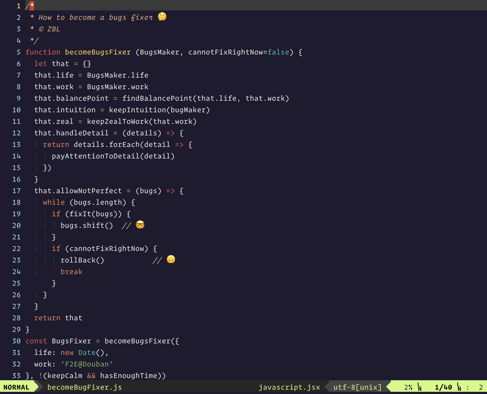

> 世界上只有两种人： Bug makers or bug fixers.
>
> ​    —— 郫县豆瓣

可能是周一不宜上线吧。

下午在做某个需求的时候，突然收到了一个之前修过但却并没有修好的小 Bug。

接着又收到了一个刚上线的新需求报过来的线上 Bug 反馈，然后紧接着同一个需求的两个、三个 Bug… 一大片，炸开了。

最后， PM 说，”这次 Bug 太多了，都先回滚吧。”

只是突然觉得，已经工作了一年多近两年的我，写代码的时候依然不走心。

其实作为程序员，被人指出你代码的 bug 是难受的，除了尴尬，有时候甚至真的会感到羞耻，会有点看不起自己也觉得会被人看不起。

我只希望自己能够在每次写代码的时候永远记住这种感觉。

之前也是遇到过各种奇奇怪怪的线上 Bug，其实大部分都是自己写的时候不用心、测试时候不上心导致。

而最近，写的时候居然总有种匆匆忙忙急着完成任务的感觉，可结果却是既没有快速完成，也没有保证质量，既不好也不快，反而耽误了很多时间在 Debug 上。

十足的 Bug Maker.

其实仔细反思一下，我是知道原因的。

<!-- truncate -->

最近一个多月以来，老实说，自己的生活发生了一些根本性的变化。

我重新认识了一些人，重新跟一些人建立了新的关系，重构了自己的交友圈，经历了一些或狗血或鸡汤的事，也渐渐开始了一种和原来不太一样的生活方式，开始吃以前没怎么吃过的东西，读一些以前不怎么读的书，说一些有得没得的话。

就像看了一场时而卡帧，时而情节又快速前进的黑白电影，散场后的我却浑浑噩噩。

其实不管怎么说，从整体来看，新的生活方式是很好的，是我曾经向往的那种。

但可能是我本来就工作不太上心，可能是我本来就懒得总结学习，可能是我之前养成的一些坏习惯，日积月累，量变成了质变，现在终于迎来了炸裂。

也有可能，是我还没有彻底做好开始新生活的准备。

我可能仍然需要提醒自己，在任何时候都要保持自己的心境。

1. 找到生活与工作的平衡点，不会被周围噪音改变自己的频率，保护自己的直觉。

   今天临时去看了下一个 bug 案发现场，居然发现自己一瞬间没有了 bug-fixing 直觉。

   之前读过一本书，说一些有伟大格局观的人，大多都有着极简生活方式，如乔布斯等。「因为只有生活方式简单的人，才更容易保护到那一刹那，获得灵感。你很难想象一个整天忙于各个社交的人，能保护到自己的直觉。反之，人们常常在无意有意与他人合谋，伤害自己的好直觉。常见的三种伤害直觉的方式有：言语；父母与配偶；运气。」

   浑浑噩噩一个多月，需要回归到规律作息，规律饮食。

   ​

2. 保持一颗热忱的心。

   个人觉得，「热忱」的状态决定未来的成就。

   每个人都希望自己在工作中被认可，有存在感。但是这些事情，如果你不热爱，就不可能把它做得真正优秀。而有了热情，才有了专注，才会坚持下来，最终发光发热。

   「人们真正注意到你的时候，不是第一眼看到你站在那里，而是发现过了这么久你居然还在那里。」

   其实我是喜欢写点代码的，有时候还会自己动手做一些小工具。

   突如其来的事情总是会有，希望自己可以调整调整，对喜欢的东西保持专注，保持一颗热忱的心。

   ​

3. 「一幅优秀的绘画作品必须比它应该有的样子更好」

   这句话出自我很喜欢的一本书《黑客与画家》。

   之前一直觉得，只有伟大的东西才是不朽的。这样导致的结果是，我对自己创造出的东西并没有太苛刻。

   书作者 Paul Grahams 举例说保存于美国国家美术馆的达·芬奇的作品《女性肖像》（Ginevrade'Benci），一般人欣赏的时候都会注意到，达·芬奇在少女的头后面摆了一片树枝，他很仔细地画出了树枝上的每一片叶子。

   许多画家也许会觉得，那不过是放在背景里的衬托物，没有人会仔细看的，不妨简单处理一下就可以了。

   但是达·芬奇不这样想。他对作品每一部分的认真程度完全不取决于预料中会不会有人仔细看这个部分。他就像篮球巨星迈克尔·乔丹（MichaelJordan），每一球都一丝不苟，绝不降低对自己的要求。

   结果就是，「所有那些看不见的细节合并在一起，就使得这样东西产生了惊人的效果，仿佛上千个细微的声音都以同一个音调在歌唱。同样地，优秀的软件也要求对美的狂热追求。如果你查看优秀软件的内部，就会发现那些预料中没有人会看见的部分也是优美的。我对待代码的认真程度远远超过我对待其他事情。」

   既然自己选择了走这条路，做这份工作，就应该要把它踏踏实实做好。

   每一个细节，每一个代码片段，每一个你认为不够美的地方，都去用心创造细心打磨。

   它可能成为不了不朽，但就是明知道一切都会被时间碾碎，也要认真面对啊。

   ​

4. 不要完美过头。

   其实出 Bug 确实是无法避免的一件事。毕竟比起开发环境，线上环境更复杂多元，影响的因素更多。

   抛开之前开发过程中有点不细心不说，但我可能每次对于上线后一些紧急 Bug 太提心吊胆了。对于上线后同行发现的 Bug 更是亚历山大。而这样就导致 Hotfix 时有点畏手畏脚，修的效率也不是特别高。

   《黑客与画家》中有个关于创业公司产品快速迭代公式：

   1.搭建原型 2.上线运营 特别建议：别管Bug 3.收集反馈 4.调整产品 5.成长壮大

   所以在某种特定环境下，也不需要太追求完美。

   线上出了 bug？修了就是嘛。实在不行，先回滚咯。

   以上。

   ​

   （很无聊的 Bouns:  How to become a bugs fixer in JavaScript way ...

