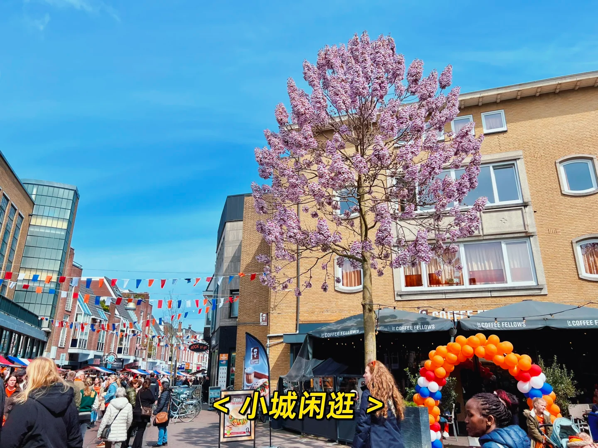

# Restarting Life Abroad at 30: A Quest for Choice and Freedom

[//]: # (@formatter:off)
Time has flown by, and it's already been nine months since I arrived in the Netherlands for work at the end of April 2023. I'm still eagerly awaiting my appointment with the GP and trying to decipher the Dutch signs on the streets. But finally, I can pause to reflect on the early part of 2024.

From the moment I decided to try working overseas, I began preparing in every aspect. Back then, ChatGPT wasn't as widely used, so I used Google Translate to complete my English resume. With courage, I sent applications to various
companies and stumbled through interviews in broken English. Thankfully, my previous job supported WFH,
allowing me to continue practicing, applying for jobs, preparing for interviews, and discussing life with my Cambly tutor in my free time. I also followed Xiaohongshu bloggers like Huanzhuzhu Run, even changing my name to something similar, drawing inspiration from their daily updates. It felt as though I didn't go through such a lengthy and arduous
preparation process. Despite solving 100 LeetCode problems and practicing spoken English for over two months, after receiving almost countless rejection letters, I was fortunate, perhaps, to receive a few job offers from Japan and the Netherlands. After some thought, I chose the Netherlands.

So, at the end of April, I quickly resigned, packed up eight years of belongings, sold nearly two hundred books, and bid
farewell to my parents and old friends before boarding the direct flight from Beijing to Amsterdam. I was so exhausted
that I couldn't even think about what was to come next. Upon landing, I was stunned for a moment by the vast grasslands and blue skies. After resting for four or five days, I started my new job. Just yesterday, it seemed I was a busy worker among the high-rises and traffic of Beijing; the next moment, I found myself in a picturesque, sparsely populated Dutch
town. Having never studied abroad, this was my first time fully immersing myself in an environment where English, and
even a mix of other languages, was spoken. The freshness, cultural shock, jet lag, and completely incomprehensible Dutch
overwhelmed me. Smiling and saying "Oh, the taste is not bad" to colleagues while eating cold sandwiches, and feeling the curious glances on the street, I remember my first month being a blur of fragments. Suddenly becoming the "foreigner" in others' eyes, tearing up over hot food – that's when I truly realized the importance of my iron-clad
Chinese stomach and language skills for integration and belonging.

Looking back, my decision was partly driven by a longing for the outside world and partly by a fear of certain
oppressive aspects of life. During the pandemic, I discussed goals and dreams with my language tutor. I told her that I always wanted the right to "choose at any time," which is something I've been pursuing all along.

[//]: # (@formatter:on)
