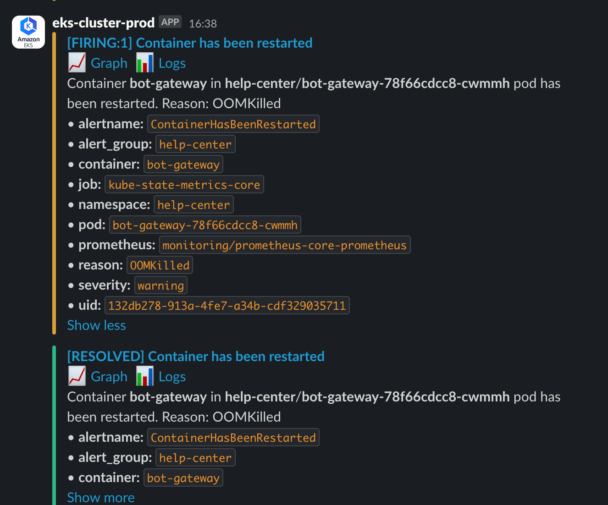
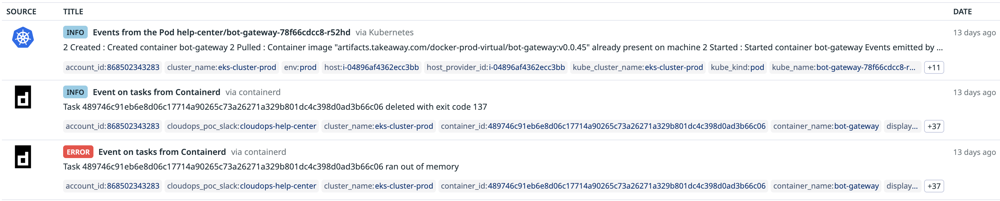
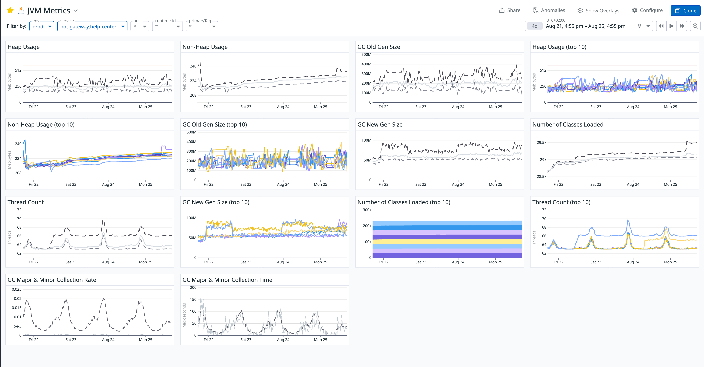
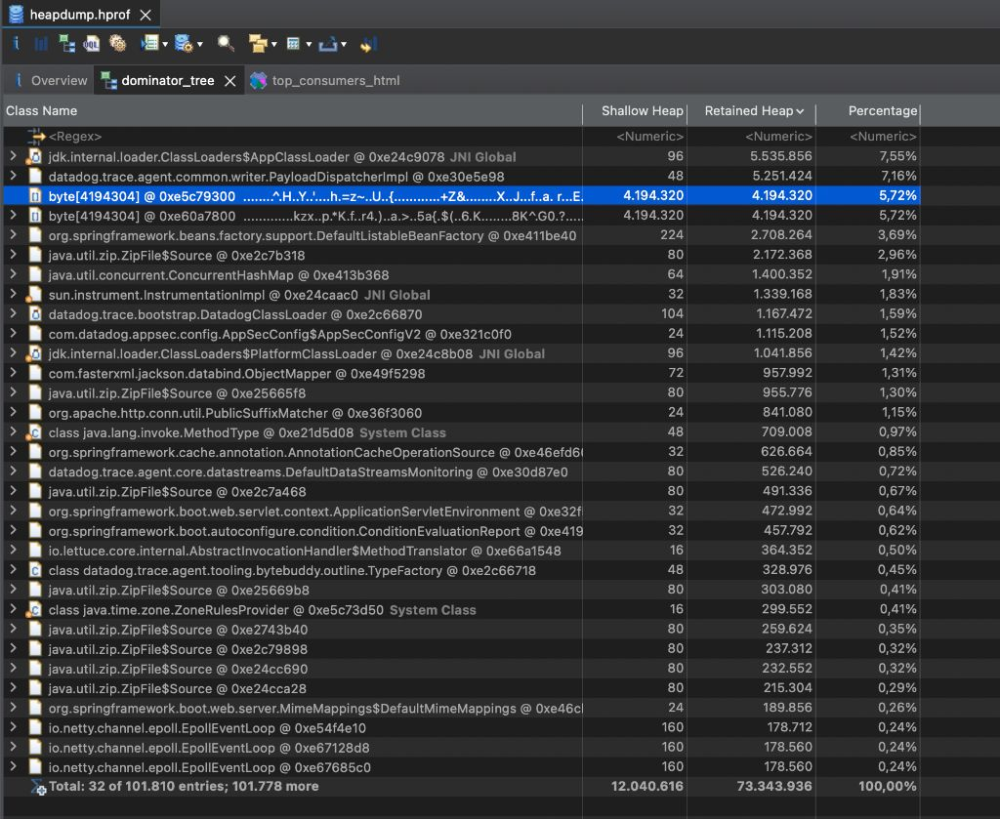
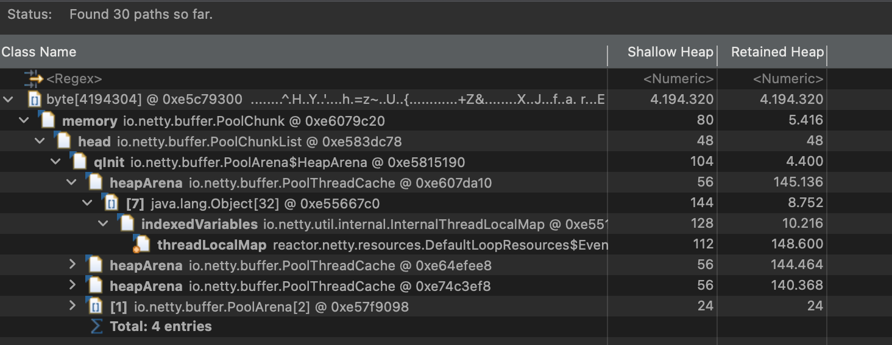
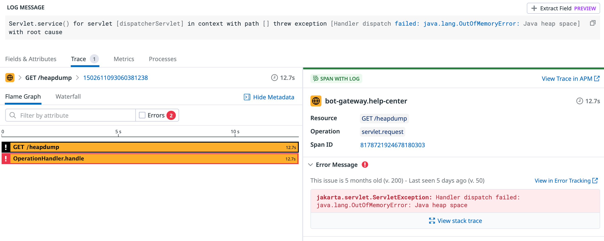
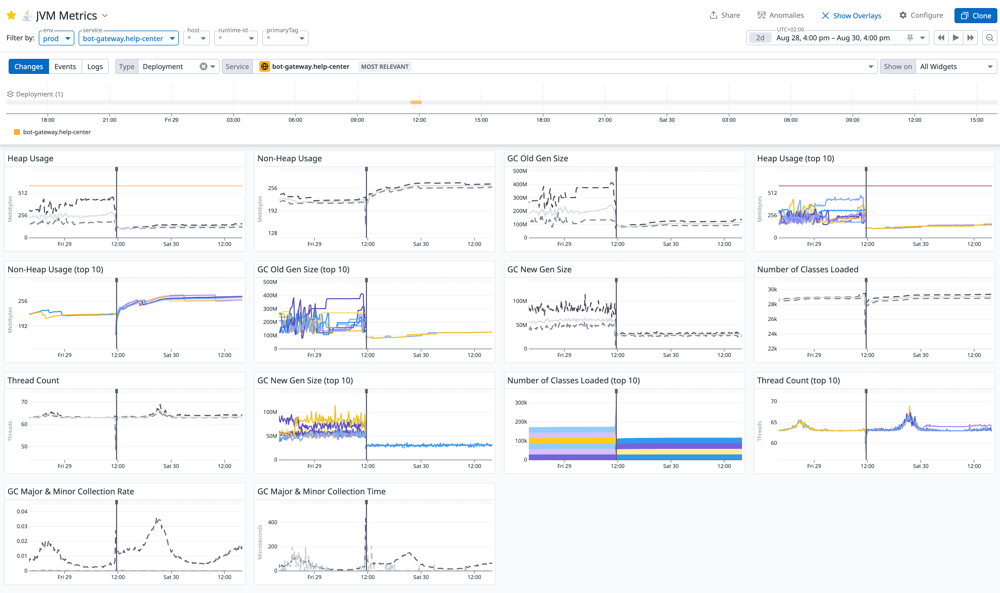

# A Deep Dive into a Production OOMKilled Alert: The Full Story from JVM Memory to a Code Vulnerability

> "In the complex world of distributed systems, every seemingly harmless alert can be a thread leading to the core of a problem."
> 

## **Introduction: A New Challenge**

A few months ago, driven by a passion for backend engineering, I joined my company's chatbot team to work on a Java project called `bot-gateway`. Interestingly, our service had been unstable for months, with Kubernetes Pods restarting intermittently every day. However, due to a busy feature development schedule, the issue was consistently postponed. What was even more interesting was that, as a newcomer to Java, after two months of shipping business features, I finally had the chance to join an "Engineering Excellence Sprint." Fueled by curiosity and a love for solving technical puzzles, I volunteered to take a deep dive into this problem.

The investigation was challenging, but the final outcome was incredibly satisfying. I can say that this journey took me through everything from business code to the JVM memory model, from K8s pod management to live production monitoring. I'm writing down the entire process here to share it with you all.

## **Part I: The Abrupt Pod Restarts**

It all began on a seemingly calm night when our alerting system was suddenly triggered:

```
[FIRING:1] Container has been restarted. Reason: OOMKilled
```

This alert came from one of our core services, `bot-gateway`.



The term `OOMKilled` spells trouble for any SRE or developer. After some research, I understood it meant a container was ruthlessly terminated by its host (a Kubernetes node) for running out of memory. What was more frustrating was how sudden and violent it was. The application layer had no time to leave any meaningful "last words"—no application logs, and only a cryptic message in the container logs:

```
Task ... ran out of memory
... deleted with exit code 137
```

`exit code 137` signifies that the process was terminated by a `SIGKILL` signal.



The service was restarting again and again, impacting user experience and putting immense pressure on the team. And so, my deep-dive investigation began.

## **Part II: Laying the Theoretical Groundwork**

I wasn't deeply familiar with the JVM before this, so this was a perfect opportunity to solidify my foundational knowledge.

Distinguishing between these two core concepts was crucial:

**`OOMKilled` vs `java.lang.OutOfMemoryError`**

- **`OutOfMemoryError` (OOM Error)**: This is the JVM's "internal conflict." The JVM realizes its own **Heap Memory** is exhausted and proactively throws an exception. It's a relatively "graceful" way to fail.
- **`OOMKilled`**: This is the container's "external conflict." Kubernetes detects that the **total memory footprint of the container** (Heap + Non-Heap + Native Memory, etc.) has exceeded its configured limit (`limits.memory`). To protect the stability of the entire node, the OS acts like an unforgiving city warden, forcibly evicting the rogue process.

**A Brief on the JVM Memory Model**

- **Heap Memory**: Stores all object instances created with `new`. It's divided into a **Young Generation** and an **Old Generation**. Objects are born in the Young Gen and are promoted to the Old Gen if they survive multiple Garbage Collection (GC) cycles. A continuously growing Old Gen usually indicates a memory leak.
- **Non-Heap Memory**: In Java 8+, this primarily refers to **Metaspace**, which stores class definitions, methods, and other metadata. A continuously growing Metaspace often signals a **ClassLoader Leak**.
- (TODO: Link to a separate JVM memory blog)

Of course, at the beginning, I had no idea whether this was a container configuration issue (e.g., the app just needed more than the 1GB of memory it was allocated) or a bug in our application code. I had no choice but to start wading through the water.

## **Part III: The Detective Work**

After consulting with various AI teachers (ChatGPT, Gemini, DeepSeek), I devised a plan: analyze monitoring metrics, inspect a memory snapshot (**Heap Dump**), and trace error logs.

### **1. The Abnormal ECG on the Metrics Dashboard**

First, I opened our JVM Metrics dashboard. The chart before the fix was shocking:



The most glaring anomaly was the **`GC Old Gen Size`** chart. It clearly showed the memory usage of the Old Generation on a relentless, **upward climb that never decreased**. This strongly suggested that a large number of objects were being improperly held long-term and couldn't be collected by GC. The heap usage consistently stayed around 500MB, which seemed odd for a stateless gateway service that keeps most of its data in a Redis cache.

### **2. The "Crime Scene" Inside the Heap Dump**

To unmask these "deadbeat" objects, we needed a heap dump. At the same time, to prevent the pod from being killed directly by the container and instead have the application throw a more gentle `OutOfMemoryError`, I tried adding various JVM flags—a bit of JVM tuning:

```xml
<jvmFlags>
    <jvmFlag>-server</jvmFlag>
    <jvmFlag>-XX:MinRAMPercentage=40</jvmFlag>
    <jvmFlag>-XX:MaxRAMPercentage=60</jvmFlag>
    <jvmFlag>-XX:MaxDirectMemorySize=192m</jvmFlag>
    <jvmFlag>-Xss512k</jvmFlag>
    <jvmFlag>-XX:NativeMemoryTracking=summary</jvmFlag>
    <jvmFlag>-XX:+UnlockDiagnosticVMOptions</jvmFlag>
    <jvmFlag>-XX:+HeapDumpOnOutOfMemoryError</jvmFlag>
    <jvmFlag>-XX:HeapDumpPath=/dumps</jvmFlag>
    <jvmFlag>-Dio.netty.leakDetection.level=PARANOID</jvmFlag>
    <jvmFlag>-javaagent:/library/dd-java-agent.jar</jvmFlag>
    <jvmFlag>-Ddd.jmxfetch.enabled=true</jvmFlag>
    <jvmFlag>-Ddd.jmxfetch.statsd.enabled=true</jvmFlag>
</jvmFlags>
```

The purpose of these flags included:

- Limiting the JVM memory range so it would throw an `OutOfMemoryError` exception when exhausted, preserving the crime scene's stack trace.
- Setting the thread stack size to 512k (since we don't have overly complex logic).
- Capping Direct Memory at 192M.
- Enabling Native Memory Tracking to analyze it with `jcmd diff`.
- Configuring `HeapDumpOnOutOfMemoryError` to save the heap dump to a K8s container volume.
- Enabling the Datadog agent's jmxfetch.

We captured a heap snapshot (`.hprof` file) via the Spring Actuator `/heapdump` endpoint. A little side story here: I used to have `exec` access to K8s pods, which made it easy to shell in, run JDK commands, and download dumps. However, for security reasons, the SRE team had recently revoked this permission, leaving `kubectl debug` as the only option. So, I had to pick a pod that looked like it was on the verge of crashing, use `kubectl` to forward its port 8080 to my local machine, and then hit `localhost:8080/heapdump` to download the file.

Opening it with the Memory Analyzer Tool (MAT) was revealing: .

1. **Suspect A: Giant `byte[]` Arrays & Netty**
The `Dominator Tree` view showed several abnormally large `byte[]` arrays. Tracing their references via `Path to GC Roots`, we found they all pointed back to `reactor.netty`'s memory pool components (`PoolChunk`). This led us to initially suspect a **Netty buffer leak**, prompting the addition of the `Dio.netty.leakDetection.level=PARANOID` JVM flag to catch any unreleased memory allocations in the logs.
    
    
    
    
    
2. **Suspect B: The Peculiar `DatadogClassLoader`**
The `Leak Suspects` report pointed to another problem: a large number of `java.util.zip.ZipFile$Source` (open JAR file handles) and `java.lang.Class` objects were being held by a classloader named `DatadogClassLoader`. This not only explained why our Non-Heap memory was slowly growing but also uncovered a chronic resource leak caused by our monitoring agent.

### **3. The Decisive Error Log (The Smoking Gun)**

With the JVM flags configured, I started monitoring. A day and night passed with no specific logs, but I noticed the pod restart frequency had significantly decreased. Just as I was feeling lost, I tried to dump another heap profile via the Spring Actuator endpoint. As luck would have it, the pod must have been truly on the edge this time. The endpoint returned a 500 error, with the reason being `java.lang.OutOfMemoryError: Java heap space`.



This was interesting. So it *could* throw an `OutOfMemoryError` after all. I immediately broadened my log search for "java.lang.OutOfMemoryError" and, to my surprise, found several instances buried in a pile of error logs. Aside from the one triggered by the `/heapdump` endpoint, all the others came from another piece of logic:

**An internal JVM OOM Error**:

```
java.lang.OutOfMemoryError: Java heap space
    at java.desktop/java.awt.image.DataBufferByte.<init>(DataBufferByte.java:93)
    ...
    at javax.imageio.ImageIO.read(ImageIO.java:1466)
    ...
    at com.justeattakeaway.botgateway.service.evidence.validators.impl.ImageValidator.readImage(ImageValidator.java:75)
```

**The case was cracked!** This stack trace was a beam of light that illuminated the entire problem. The error was happening in our `ImageValidator` service! I quickly reviewed the code. We have a feature that allows users to upload images of food-related issues for customer service. During the upload, the backend performs validation (e.g., image dimensions, file size, format), which relies on `ImageValidator`. Internally, it was calling `ImageIO.read()`, a method that loads the **entire, uncompressed pixel data** of the image into heap memory.

This meant we were holding the complete user-uploaded image in memory, which is incredibly resource-intensive over time. These large objects couldn't be GC'd and became "tenants for life" in the Old Gen. An even more severe security risk was that a malicious user could upload an "image bomb"—a file that is small in size but has an extremely high resolution—to instantly exhaust all memory. For example, a 20,000x20,000 pixel image requires about **1.6 GB** of heap space! This was a critical code vulnerability.

### **Part IV: The Fix**

We now had a complete picture of the problem:

1. **Chronic Illness**: A ClassLoader leak from the Datadog Agent was slowly raising the Non-Heap memory baseline.
2. **Complication**: A potential buffer leak in Netty was adding pressure to the Heap.
3. **The Trigger**: The dangerous image handling logic in `ImageValidator` was the final straw that broke the camel's back.

Our solution had to be a targeted, three-pronged attack:

1. **The Critical Patch (The Cure)**: Refactor `ImageValidator`. We abandoned the direct call to `ImageIO.read()` and switched to the safer `ImageReader` API to read the image's dimensions (metadata) *before* fully decoding it. If the dimensions exceeded a preset safety threshold, the image was rejected immediately.
2. **Process Re-engineering (Strengthening the Foundation)**: We refactored the entire file-handling flow from a `byte[]`based approach to an `InputStream`based, streaming approach, reading data in 8KB chunks. From the source, if the size exceeded the limit, the image was rejected, avoiding the problem of loading large files into memory all at once.
3. **Long-term Governance (Eradicating the Disease)**: We identified our Datadog Java Tracer version (`1.39.0`) and planned an upgrade. Upgrading to the latest version would resolve the known ClassLoader leak and other minor logging errors simultaneously.

### **Part V: Calm After the Storm**

After deploying the fix, the results were immediate and dramatic. The JVM Metrics dashboard showed an unprecedented level of stability: 



- **Heap Usage** no longer had fatal spikes and settled into a healthy, periodic pattern, dropping from 500MB to a stable 150MB.
- **Old Gen Size** stopped its relentless growth, stabilizing at a reasonable 100MB (down from 400MB).
- **New Gen Size** dropped from 90MB to 30MB.
- The `OOMKilled` alerts fell silent.

### **Final Chapter: Lessons and Reflections**

This thrilling investigation (during which my carefully configured JVM flags were rolled back multiple times due to other production incidents) left us with invaluable lessons:

1. **Everything is Connected**: Complex production issues are often the result of multiple, seemingly unrelated factors (application vulnerabilities, dependency leaks, framework usage) compounding each other.
2. **Theory Guides Practice**: A deep understanding of foundational knowledge like the JVM memory model is the key to correctly interpreting monitoring data and memory snapshots.
3. **Tools are a Detective's Eyes**: Proficiency with monitoring systems (Metrics), memory analyzers (MAT), and built-in diagnostic tools is fundamental to efficient problem-solving.
4. **Defensive Programming**: **Never trust user input**. Implementing strict, memory-safe validation for untrusted data (like uploaded files) is a lifeline for system robustness.

This experience not only solved a tricky production issue but also deepened my understanding of the JVM, containerization, and distributed systems. Every production problem is a precious learning opportunity. It's through these challenges that we grow into better engineers—better Builders, Solvers, and Collaborators.
