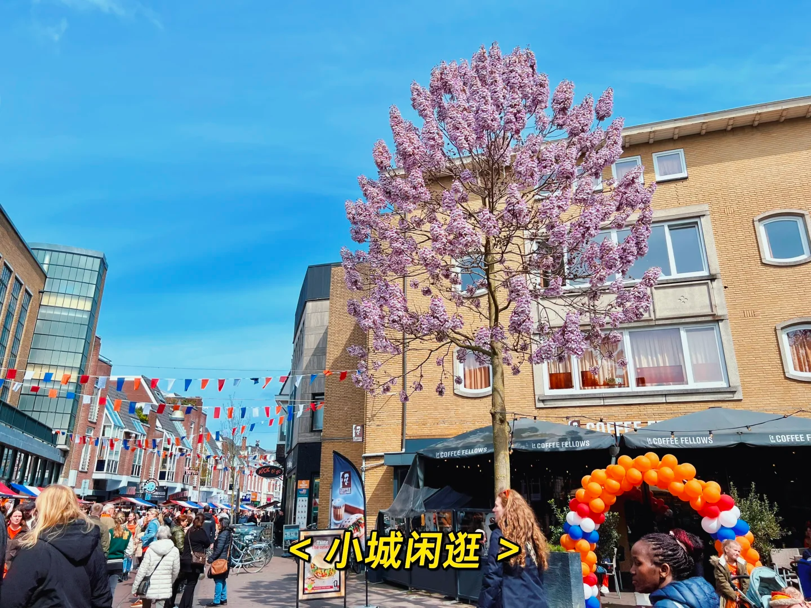

# 30岁异国重启生活：选择与自由的探索

日子飞快，距离 23 年四月底飞来荷兰工作已经九个月了。当然现在的我仍然在苦苦等待 GP，仍然看不懂路边的荷兰标语，不过也终于可以喘口气，在
2024 年初给自己做一些回顾。

自打开始决定试试海外工作后，就开始全方面地准备了。当时 ChatGPT
还没这么普遍应用，我用着谷歌翻译写完了英文简历，鼓起勇气给各种公司投了简历，又操着一口蹩脚英语磕磕绊绊面完试。幸好之前的工作支持
WFH，上班前下班后就继续做题、投简历、准备面试、跟 Cambly 老师聊人生。还学习小红书博主
环猪猪润，甚至把名字都改得类似，每天看大家更新也会受到鼓舞。好像自己并没有经历过那么漫长难熬的备润过程。就这样，尽管也刷了
LeetCode 100 题，练了两个多月口语，在拒信也差不多收到手软的情况下，不知道是否称得上幸运，也顺利拿到了几个 offer.
有日本，有荷兰，简单分析考虑后，还是选择了荷兰。

于是四月底一周内火速离职、打包完八年的行李、卖了近两百本书，告别父母和老友们，就踏上了北京直飞阿姆的航班。累到疲惫，以至于在航班上的我根本没有精力去想接下来要面对的是什么。落地后，被一望无际的大草原和大蓝天震惊了一会儿。稍作休息四五天，就入职了新公司开始了新的工作。好像昨天的我还在北京高楼大厦车水马龙打工人，下一秒就呆在了风景优美人烟稀少的荷兰小城。加上从来没有在外留学过，这是我第一次非常沉浸式地在一个纯英文，甚至夹杂一些小语种的环境中生活工作。扑面而来的新鲜感、文化冲击，倒着时差盯着完完全全看不懂的荷兰语，嚼着冰冷三明治还要和同事微笑说
噢味道还不错，走在路上隐隐约约感觉到了周围异样目光，只记得第一个月的我过得异常恍惚，全是碎片。就这么突然成为了别人眼中的“外国人”，在吃到热乎的食物会热泪盈眶，这才艰难发现自己有个铁打不动的中国胃，以及语言沟通能力于我、于融入来说是有多么重要。

回过头来想，我当时做这样的选择，一部分出于对外面世界的向往，另一部分也有出于对某些压抑生活的恐惧。疫情期间，和口语老师聊到了目标和梦想，我对她说，我只希望自己能拥有“随时都有选择”
的权利，这是我可能一直在追求的东西。
