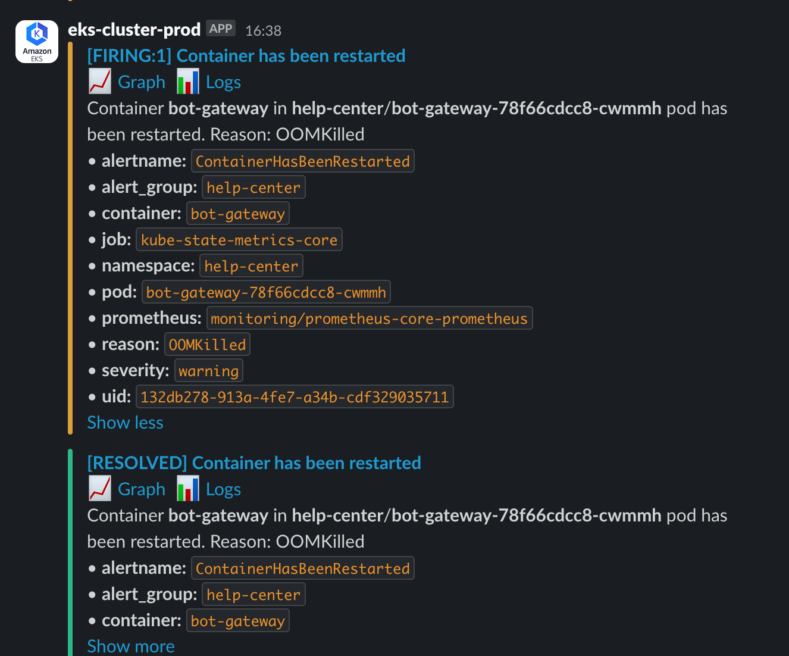
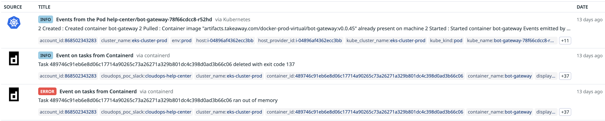
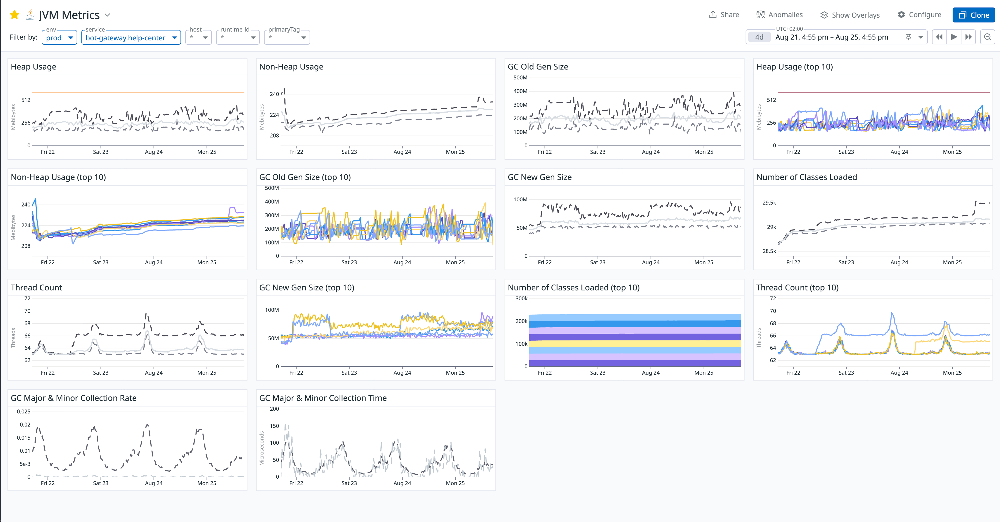
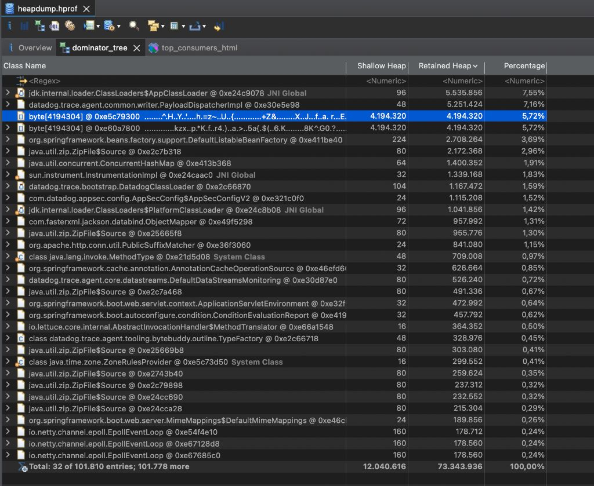
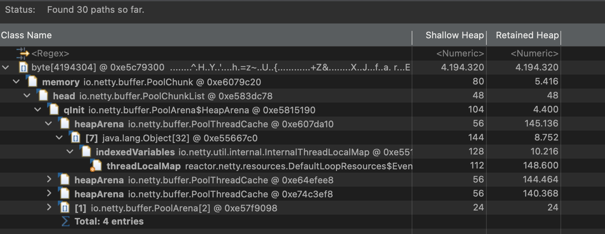
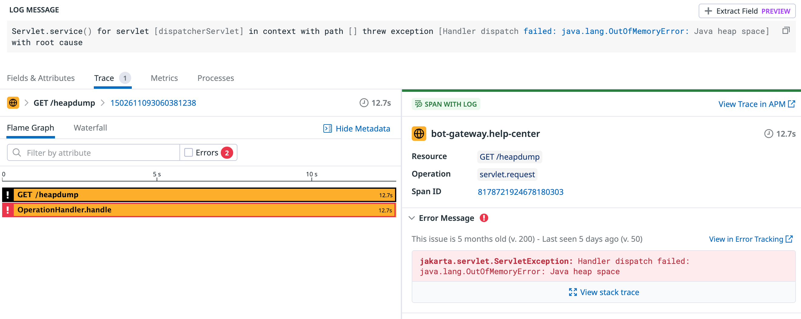
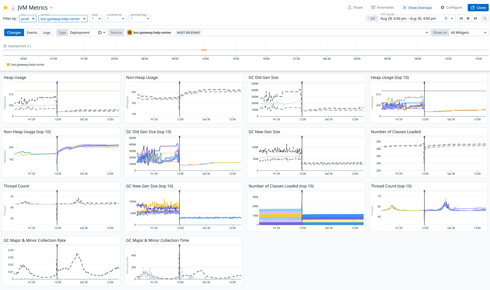

# 一次生产环境 OOMKilled 告警引发的深度排查：从 JVM 内存到代码漏洞的全链路分析

> "在分布式系统的复杂世界里，每一个看似无害的告警，都可能是一条通往问题核心的线索。”
> 

## **Intro - 新的挑战**

几个月前，秉着对 backend engineering 的热爱，我加入了公司的 chatbot 团队，负责一个 Java 项目 bot-gateway 的开发。有意思的是，我们的服务在过去几个月里一直不稳定，每天总有 Kubernetes Pods 时不时地重启。不过由于业务繁忙，这个问题一直被搁置。更有意思的是，作为一名新加入的 Java 小兵，在狂奔开发业务功能两个月后，终于赶上了 Engineering Excellence Sprint. 怀着对技术问题的好奇心和解谜的热情，我主动请缨深入调查这个问题。

排查过程充满挑战，但最终的结果令我非常满意。可以说这次从业务代码到 JVM 内存模型，从 k8s pod 管理到线上监控告警，都详细捋了一遍。在此将整个过程记录下来，与大家分享。

## **一 / 突如其来的 Pod 重启**

一切都始于一个看似平静的夜晚，我们的告警系统突然被触发：

```
[FIRING:1] Container has been restarted. Reason: OOMKilled
```

这个告警来自我们的核心服务之一 `bot-gateway`。



`OOMKilled` 这个词对任何 SRE 或开发工程师来说都意味着麻烦。研究了下，它表示容器因内存耗尽而被其宿主（Kubernetes 节点）无情地杀死。而且更恼火的是，这一切发生得如此突然且暴力， 应用层根本来不及留下任何有价值的“遗言”，没有应用层日志，而容器日志中也只有寥寥数语：

```
Task ... ran out of memory
... deleted with exit code 137
```

`exit code 137` 表示进程收到了`SIGKILL`信号而被终止。



服务一次次地重启，影响了用户体验，也给团队带来了巨大压力。于是我开始了深入调查之旅。

## 二 / 理论基础准备

之前对 JVM 并不熟悉，正好借此机会，夯实我的理论基础。

这里两个核心概念的区分至关重要：

**`OOMKilled` vs `java.lang.OutOfMemoryError`**

- **`OutOfMemoryError` (OOM Error)**: 这是 JVM 的“内部矛盾”。JVM发现自己的**堆内存（Heap）**不足，会主动抛出异常。这是一个相对“优雅”的失败方式。
- **`OOMKilled`**: 这是容器的“外部冲突”。当 Kubernetes 发现整个**容器的总内存占用**（堆内存 Heap + 非堆内存 Non-Heap 和原生内存 Native memory 等）超过了设定的上限 (`limits.memory`)，为了保护整个节点的稳定，操作系统会像一个无情的城管，会强制将这个失控的进程（容器）驱离。

**JVM内存模型简介**

- **堆内存 (Heap Memory)**：存储代码中`new`出来的所有对象实例，被分为**新生代 New Gen** 和**老年代 Old Gen**。对象在新生代中诞生，经历数次垃圾回收（GC）后依然存活的，会被晋升到老年代。如果老年代持续增长且无法回收通常意味着内存泄漏
- **非堆内存 (Non-Heap Memory)**：在 Java 8 及以后版本中，主要指元空间（**Metaspace**），存储类的定义、方法、字段等元数据。元空间持续增长通常表明类加载器泄漏（**ClassLoader Leak**）
- （TODO 补链接到另一篇 JVM 内存 blog）

当然，我一开始也并不清楚到底是容器配置有问题（比如这个 Java 应用就是需要这么大的内存，申请的机器内存 1G 过小），还是咱的应用代码有问题，只能硬着头皮开始淌水。

## 三 / 抽丝剥茧的排查过程

在请教各类 AI 老师 (ChatGPT, Gemini, DeepSeek…) 后，我开始了以下计划：监控指标分析、内存快照 **Heap Dump** 检查和错误日志追踪。

### **一、监控指标的“异常心电图”**

我们首先打开了 JVM Metrics 监控仪表盘。修复前的图表令人震惊：



最明显的异常是 **`GC Old Gen Size (老年代大小)`** 图表。可以清晰地看到，老年代的内存占用呈现出一种**只增不减、持续攀升**的态势。这强烈暗示有大量对象被错误地长期持有，无法被 GC 回收， Heap usage 常年保持在 500M 左右。对于一个主要数据都放 Redis 缓存，无需保存状态的 gateway 服务来说，这个数字显得有些奇怪。

### **二、深入内存快照（Heap Dump）的“犯罪现场”**

为了看清这些“老赖”对象的真面目，我们需要获取 heapdump. 同时，为了让 pod 不再被容器直接杀死，而是更温柔地让应用层抛出 OutOfMemoryError，我尝试了添加各种 JVM Flags，也算是做了些 JVM 调优：

```
<jvmFlags>
    <jvmFlag>-server</jvmFlag>
    <jvmFlag>-XX:MinRAMPercentage=40</jvmFlag>
    <jvmFlag>-XX:MaxRAMPercentage=60</jvmFlag>
    <jvmFlag>-XX:MaxDirectMemorySize=192m</jvmFlag>
    <jvmFlag>-Xss512k</jvmFlag>
    <jvmFlag>-XX:NativeMemoryTracking=summary</jvmFlag>
    <jvmFlag>-XX:+UnlockDiagnosticVMOptions</jvmFlag>
    <jvmFlag>-XX:+HeapDumpOnOutOfMemoryError</jvmFlag>
    <jvmFlag>-XX:HeapDumpPath=/dumps</jvmFlag>
    <jvmFlag>-Dio.netty.leakDetection.level=PARANOID</jvmFlag>
    <jvmFlag>-javaagent:/library/dd-java-agent.jar</jvmFlag>
    <jvmFlag>-Ddd.jmxfetch.enabled=true</jvmFlag>
    <jvmFlag>-Ddd.jmxfetch.statsd.enabled=true</jvmFlag>
</jvmFlags>
```

这些参数的作用包括：

- 先是限制 JVM 内存使用范围，这样内存用尽时会直接抛 `OutOfMemoryError`, 保留案发现场的错误栈
- 将线程栈限制为 512k（考虑到没有过于复杂的逻辑）
- 设置 DirectMemory 上限 192M
- 开启 NativeMemory Tracking，便于使用 jcmd diff 分析 NativeMemory
- 配置 HeapDumpOnOutOfMemoryError 并将 heapdump 保存到 k8s 容器 volume
- 启用 Datadog agent `jmxfetch`

我们通过 Spring Actuator 的 `/heapdump`端点，捕获了一份堆内存的快照文件（`.hprof`）。这里有个小插曲，虽然我之前有 k8s pods exec 权限，可以轻松 shell 进 pod 执行各种 JDK 命令和下载 heapdump, 不过出于安全考虑，SRE 最近收回了这一权限，只能通过 k8s pods debug 方式操作。所以我只能挑了一台看起来内存马上要爆了的机器，使用 kubectl 转发机器 8080 端口流量到本地，然后本地访问 Spring Actuator 的 `localhost:8080/heapdump`下载 heapdump 到本地。

使用内存分析工具MAT (Memory Analyzer Tool)打开它，信息量还是挺大的：

1. **嫌疑人A：巨大的`byte[]`数组与Netty**`Dominator Tree`视图显示，堆中有几个异常巨大的`byte[]`数组。通过 `Path to GC Roots`追溯其引用链，发现它们最终都指向了`reactor.netty`的内存池组件 (`PoolChunk`)。这让我们初步怀疑，是否存在 **Netty 缓冲区泄漏**，于是添加了 `-Dio.netty.leakDetection.level=PARANOID` JVM 参数，以便在日志中捕获 Netty 内存分配未释放的报错。
    
    
    
    
    
2. **嫌疑人B：行为诡异的`DatadogClassLoader**Leak Suspects`报告则指出了另一个问题：大量的`java.util.zip.ZipFile$Source`（打开的JAR文件句柄）和`java.lang.Class`对 象实例被一个名为`DatadogClassLoader`的类加载器持有。这不仅解释了非堆内存（Non-Heap）缓慢增长的原因，也揭示了一个由监控探针引发的慢性资源泄漏。

### **三、决定性的错误日志（The Smoking Gun）**

配置好 JVM 参数后，我就开始 monitoring 了。放了一天一夜，没有收到具体日志，但发现 pods 重启频率明显降低。正当我一头雾水一筹莫展时，我又尝试再次调用 Spring actuator 接口 dump 一份 heap hprof，好巧不巧，这次机器可能真的出于崩溃边缘了，这个接口返回了 500，原因是 `java.lang.OutOfMemoryError: Java heap space`



这就有意思了，原来它是会抛 OutOfMemoryError 的呀。赶紧扩大搜索范围，关键词 "java.lang.OutOfMemoryError" 哐哐哐一顿搜日志，结果居然搜出来了好几个！原来它们都埋在了一堆 error 日志中。除了这一个是 `/heapdump` 接口触发的，其余的全部来自另一个逻辑：

**JVM OOM Error**：

```
java.lang.OutOfMemoryError: Java heap space
    at java.desktop/java.awt.image.DataBufferByte.<init>(DataBufferByte.java:93)
    ...
    at javax.imageio.ImageIO.read(ImageIO.java:1466)
    ...
    at com.justeattakeaway.botgateway.service.evidence.validators.impl.ImageValidator.readImage(ImageValidator.java:75)
```

**真相大白！** 这个堆栈追踪如同一束光，照亮了整个案件的核心。原来错误发生在我们的`ImageValidator`服务中！我迅速看了下代码，我们有一个功能允许用户上传食品问题图片供客服处理。在上传图片时，后端会进行校验（如图片尺寸、文件大小和格式等），这些校验依赖 ImageValidator， 而它内部则调用了`ImageIO.read()`来处理用户上传的图片，这个方法会将**完整的、未压缩的图片像素数据全部**加载到堆内存中。

这意味着我们在内存中会完整保存用户上传的图片，长期累积下来极其消耗资源，这些大对象也没法被 GC，就会变成 Old Gen 钉子户，在堆中赖死赖活。更严重的安全隐患是，恶意用户可以上传一个文件大小不大但分辨率极高的“图片炸弹”，瞬间耗尽所有内存。例如，一张 20000x20000 像素的图片，在内存中需要约 1.6 GB 的空间！这是一个致命的代码漏洞。

### **四、拨乱反正 - 根除三大顽疾**

现在，我们对整个问题有了完整的画像：

1. **慢性病**：Datadog Agent 的类加载器泄漏，缓慢抬高了非堆内存基线
2. **并发症**：Netty 的潜在缓冲区泄漏，增加了堆内存压力
3. **导火索**：ImageValidator 中危险的图片处理逻辑，成为压垮骆驼的最后一根稻草

我们的解决方案也必须对症下药，三管齐下：

1. **紧急修复（治本）**：重构`ImageValidator`。放弃直接调用`ImageIO.read()`，改用更安全的`ImageReader` API，在完整解码图片前先读取尺寸元数据。一旦尺寸超过预设的安全阈值，直接拒绝该图片。
2. **流程改造（固本）**：我们将整个文件处理流程从基于`byte[]`的方式重构为基于`InputStream`的流式处理，8KB 8KB 地分块读取到内存中。从源头开始，一旦 size 超过预设的大小，直接拒绝该图片，避免了将大文件一次性加载到内存中的问题。
3. **长期治理（除病根）**：确定 Datadog Java Tracer 版本（1.39.0）并制定升级计划。升级到最新版同时解决了已知的类加载器泄漏和一些次要日志错误。

### **五 / 雨过天晴 - 稳定的系统**

部署修复补丁后，效果立竿见影。JVM Metrics 仪表盘呈现出前所未有的平稳：



- **堆内存（Heap Usage）** 不再有致命的尖峰，呈现出健康的周期性波动，从 500MB 稳定在 150MB。
- **老年代（Old Gen Size）** 不再持续增长，稳定在一个合理的水平 400MB -> 100MB。
- New Gen Size: 90 MB -> 30MB.
- `OOMKilled`告警彻底沉寂

### **最终章 / 经验与反思**

这次惊心动魄的排查之旅（期间因业务线上问题，导致配置好的 JVM Flags 被多次回滚），给我们留下了宝贵的经验：

1. **万物皆有关联**:：复杂的生产问题往往是多个看似无关的因素（应用漏洞、依赖泄漏、框架使用）叠加的结果。
2. **理论指导实践**:：对 JVM 内存模型等基础知识的深刻理解，是正确解读监控数据和内存快照的钥匙。
3. **工具是侦探的眼睛**：熟练运用监控系统（Metrics）、内存分析器（MAT）和框架自带的诊断工具，是高效定位问题的根本
4. **防御性编程**: **永远不要相信用户的输入**。对不可信数据（如上传的文件）进行严格的、内存安全的校验，是保证系统健壮性的生命线。

这次经历不仅解决了一个棘手的生产问题，更让我对 JVM、容器化和分布式系统有了更深的理解。每一个生产环境的问题都是宝贵的学习机会，正是通过这些挑战，我们才能不断成长为更好的工程师，更好的 Builder, Solver, Collaborator.
