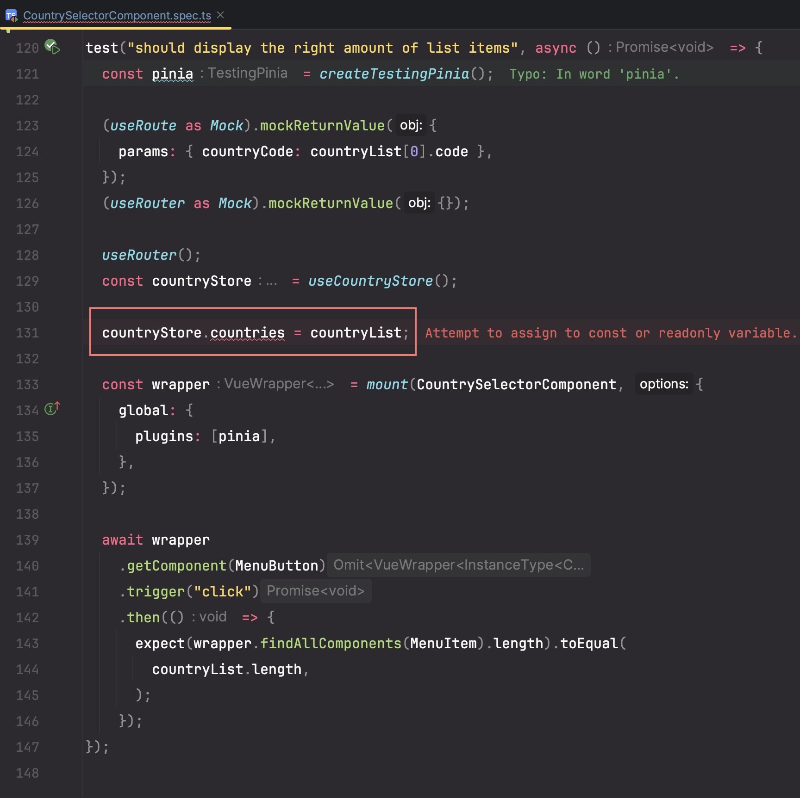

# TDD - Vitest mock bug

## Contents

- How to mock vue-router in vitest
- How to design a good store

## Background

我们目前开发的项目，无论前后端都是基于 TDD 的，对于前端我们使用 `vitest` 作为测试框架，同时有 `vue-test-utils` 作为测试工具，Tech
stack: TypeScript + Vue3 + vue-router + pinia + vitest.

上周同事提出她正在做的 从 okta userinfo API 读取当前用户 country group
权限的功能，代码实现已经完成，但提交代码时却发现有几个已有的测试用例一直没法通过，且都是遇到的同一个问题,

> TypeError: Cannot read properties of undefined (reading 'beforeEach')

同事一时半会不知道原因，也没有想到很好的解决方案，所以尝试引入了一个第三方库 vue-router-mock, 用来 mock vue-router，作为一个
workaround.

其实这个问题我之前也遇到过，但我们每次都找到其他的办法绕过去了；这次我觉得应该可以有不引入新的三方库的方法，所以就对此进行了研究，尝试了多种方法，最后修复了这个问题。

完成后，又继续和同事一起梳理了代码，把 countryStore 的功能和数据合并至 userStore，这样也方便了测试。

## Problem

这是从当时的 countrySelectorComponent spec 摘的一个失败的 test case, 以及当时的 countryStore 的代码。



运行这个 test case 会报错，错误信息如下：


> TypeError: Cannot read properties of undefined (reading 'beforeEach')

能看出这个报错源于 `router/index.ts` 中的 `router.beforeEach(() => {})`.

```ts
// router/index.ts

const router = createRouter({
    history: createWebHistory(process.env.BASE_URL),
    routes,
});

router.beforeEach(() => {
});

export default router;

```

## Analysis

一开始会觉得很神奇为什么会有这个报错，因为我们并没有直接在 test case 中调用 `router/index.ts`，并且在这个测试文件中一开始就
mock 了 vue-router，理论上不应该会调用到 router/index.ts 中的代码。

```ts
vi.mock("vue-router");
```

然后我又仔细观察了下这个错误信息，


可以看到其实是 `src/main.ts` 中 import 了 `router/index.ts`.
于是我顺着这个思路，分析了这条长长的依赖路径。

src/tests/components/CountrySelectorComponent.spec.ts  (`import CountrySelectorComponent from "../../components/CountrySelectorComponent.vue";` )

-->

src/components/CountrySelectorComponent.vue ( `import { useCountryStore } from "../stores/CountryStore";`)

-->

src/stores/CountryStore.ts (`import { useUserStore } from "./UserStore.ts";`)

-->

src/stores/UserStore.ts (`import { i18n } from "../main";`)

-->

src/main.ts (`import router from "./router";`)

-->

src/router/index.ts (`router.beforeEach(() => {})`)

一层层依赖关系分析下来，这样就清楚了，我们确实是有在代码中依赖 `router/index.ts`.

另外我们可以再研究下错误栈

```
TypeError: Cannot read properties of undefined (reading 'beforeEach')
    at /Users/binliu.zhang/workspace/ivr-client/src/router/index.ts:49:8
    at VitestExecutor.runModule (file:///Users/binliu.zhang/workspace/ivr-client/node_modules/vite-node/dist/client.mjs:341:5)
    at VitestExecutor.directRequest (file:///Users/binliu.zhang/workspace/ivr-client/node_modules/vite-node/dist/client.mjs:325:5)
    at VitestExecutor.cachedRequest (file:///Users/binliu.zhang/workspace/ivr-client/node_modules/vite-node/dist/client.mjs:188:14)
    at VitestExecutor.dependencyRequest (file:///Users/binliu.zhang/workspace/ivr-client/node_modules/vite-node/dist/client.mjs:222:12)
```

看起来这是一段 vitest
运行时逻辑，[源代码](https://github.com/vitest-dev/vitest/blob/main/packages/vitest/src/runtime/execute.ts#L244)在这里


为了搞清楚这段代码是做啥，我启用了 debug breakpoints 大法，发现是 `vitest` 在执行 test case 时，会先对 test case
的依赖进行静态分析，在 test case 运行前，对每个依赖的 module 都进行一次 `dependencyRequest`，并且会 `runModule`.


我们在测试文件最开始调用了 `vi.mock("vue-router")`，It will always be executed before all imports.
但是在这个 `router/index.ts` 中，我们发现 `router`
其实来源于 `createRouter` --

```ts
// router/index.ts
import {createRouter, createWebHistory} from "vue-router";

const router = createRouter({
    history: createWebHistory(process.env.BASE_URL),
    routes,
});
router.beforeEach(() => {
});
```

而 `createRouter` 现在只是一个 mock 的空函数 `() => {}`，调用它只会 `undefined`, 所以 `router` 也是 `undefined`
，所以才会报错 `Cannot read properties of undefined (reading 'beforeEach')`.

## Solution

既然知道了问题出自哪里，那么解决起来就比较简单了。鉴于我们并没有在 test case 中使用 router/index.ts 中的代码，所以我们可以在
`test/setup.ts` 中 mock 掉 `router/index.ts`，这样就不会调用到 router/index.ts 中的代码了。

```ts
// test/setup.ts
import {vi} from "vitest";

vi.mock("../router/index.ts", () => ({
    default: {},
}));
````

加上这段代码后，问题得到了解决。

## 继续思考

初步解决这个问题后，我又继续思考了下，如果我们不在 test/setup.ts 中 mock 掉 `router/index.ts`，而是在 test case 中按照之前
mock `useRouter` & `useRouter` 的方式，mock 掉 `createRouter` 和 `createWebHistory`，是否也可以解决这个问题呢？

尝试了以下的代码，发现是不行的。

```ts
// won't work

vi.mock("vue-router");
const mockRouter = {
    push: vi.fn(),
};
test("should display the right amount of list items", async () => {
    (useRoute as Mock).mockReturnValue({
        params: {countryCode: countryList[0].code},
    });
    (useRouter as Mock).mockReturnValue({});

    (createRouter as Mock).mockReturnValue(mockRouter);

});
```

运行 test case，会报同样的错误
> TypeError: Cannot read properties of undefined (reading 'beforeEach')
>
>  at /Users/binliu.zhang/workspace/ivr-client/src/router/index.ts:49:8


为什么呢？我们知道，`createRouter` 和 `createWebHistory` 是在 `router/index.ts` 中被调用的，如前面所说，因为 vitest
会先分析依赖 `VitestExecutor.dependencyRequest()`，然后 `VitestExecutor.runModule()`，这个过程在 test case
实际代码运行之前，所以这样是行不通的。

继续探索了下，如果我们不 mock `router/index.ts` 文件，而是在测试文件顶部，使用 `importOriginal` mock `createRouter`
也是可以的。不过在单一文件中，对于每个 test case，`useRouter` & `useRoute` 都是返回一样的 mock 值，无法根据不同的 test case
做到动态赋值，不太灵活。

```ts
const mockRouter = {
    push: vi.fn(),
};
vi.mock("vue-router", async (importOriginal) => {
    const mod = await importOriginal<typeof import("vue-router")>();
    return {
        ...mod,
        // replace some exports
        createRouter: () => ({
            push: vi.fn(),
            beforeEach: vi.fn(),
        }),
        useRoute: () => ({
            params: {countryCode: countryList[0].code},
        }),
        useRouter: () => mockRouter, // NOTE: must return a reference to the same object, otherwise `spyOn` won't work
    };
});
```

综上，我们还是选择了在 test/setup.ts 中 mock 掉 `router/index.ts`，这样对于每个 test case, 我们可以根据需要
mock `useRouter` & `useRoute` 的返回值。

## CountryStore merged into UserStore

严格上说，当我们利用 okta user group 来做 country group 权限相关后，countryStore 的数据基本都会来自用户登录鉴权后；不同于其他的
store，比如 flowStore 数据只来源于 flowService, audioFileStore 的数据只来源于 audioFileService，而 countryStore, userStore
这俩的数据来源其实是一个地方 – okta group API, 所以完全有理由将这俩 store 合并成一个，并且也不需要创建很多中间 computed
value 如 userGroups, countriesCode, 这样可以直接在用户登录拿到 groups 数据后，对其进行处理拿到 countries 数据。同时不是
computed
而直接是单纯的 ref ，很容易在测试中设置不同的值，方便测试。